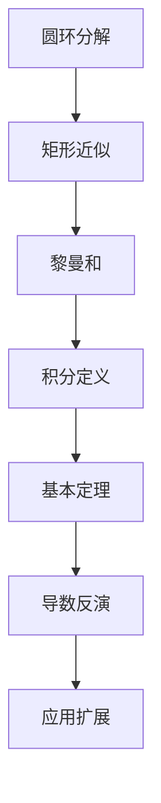
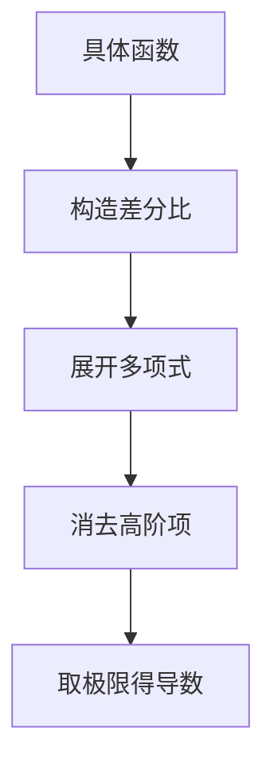
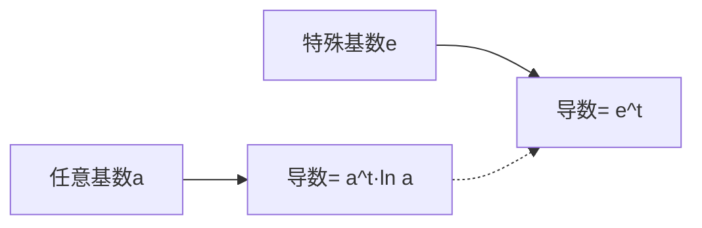
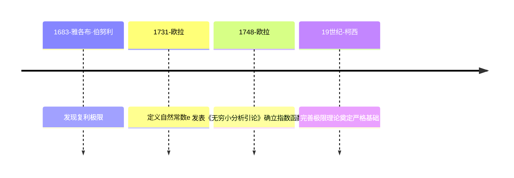
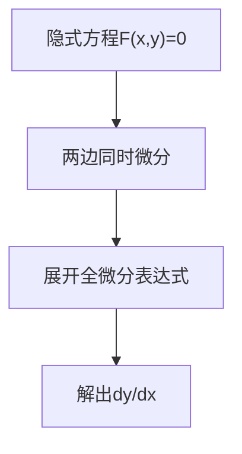
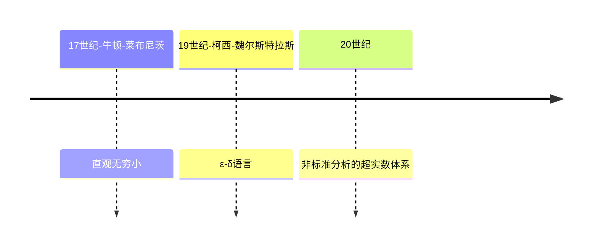

# 微积分本质系列合集 

# 【01】微积分的本质

## 🌟 核心发现：几何与积分的深刻联系

### 1. 圆面积公式的几何重构

#### 🔍 分析方法

- **同心圆环分解**：将圆分解为无数同心圆环（半径r∈[0,3]）

- **单环近似展开**：每个环展开为矩形（周长2πr × 厚度dr）

- **整体面积求和**：
  $$
   \sum 2πr·dr  → 积分  \int_0^3 2πr\ dr 
  $$
  

#### 📐 几何转换

- **面积三角形化**：积分转换为底3高6π的三角形面积

- **公式推导**：
  $$
  S = \frac{1}{2}×3×6π = 9π = πR^2
  $$
  

### 2. 积分本质的几何启示

#### 💡 关键认知

- **微观求和 → 宏观图形**：无限细分求和转化为函数图像下面积

- **普适性应用**：适用于速度-时间积分求位移等各类累积问题

- **积分函数定义**：
  $$
  A(x) = \int_0^x t^2 dt
  $$
  （抛物线x²下的面积）

### 3. 导数与积分的舞蹈

#### 🎭 基本定理可视化

| 现象         | 数学表达 | 几何解释                     |
| ------------ | -------- | ---------------------------- |
| 面积微分变化 | 公式1    | 微小增量dx对应面积条带≈x²·dx |
| 导数本质     | 公式2    | 积分函数的导数恢复原函数     |
| 互逆关系     | 公式3    | 微积分的阴阳统一             |

数学表达 - 公式1：
$$
\frac{dA}{dx} \approx x^2
$$
数学表达 - 公式2：
$$
A'(x) = x^2
$$
数学表达 - 公式3：
$$
\frac{d}{dx} \int_0^x f(t)dt = f(x)
$$


### 4. 重要概念网络



## 📚 深度洞见

### 1. 数学思维范式

- **近似艺术**：dr越小，环→矩形近似越精确

- **维度跃迁**：一维线积分（周长）→ 二维面积

- **无限细分哲学**：
  $$
  lim⁡dr→0∑2πr⋅dr=∫0R2πrdr
  $$
  

### 2. 核心公式演化

$$
离散求和→连续积分<==>∑r=032πrΔr→∫032πr dr
$$

$$
{ 三角形面积→圆面积公式<==>
12×底×高→πR2 }
$$

### 3. 思维训练要点

- **逆向工程思维**：从导数反推原函数（反向破解积分）
- **几何代数统一**：图形面积 ↔ 符号积分 ↔ 导数关系
- **误差控制艺术**：掌握何时可忽略高阶无穷小（如dr²项）

## 🧭 学习导航

### 1. 概念衔接地图

```python
   圆环分解 → 黎曼和 → 积分定义
　　　↓　　　　  ↓
 同心对称性 → 函数图像 → 导数关系
　　　　　　　   ↓
　　　  　基本定理深度理解
```

### 2. 关键问题反思

- 为何选择同心圆环而非其他分割方式？
- 当dr→0时，环厚度误差如何消失？
- 基本定理如何统一微观变化与宏观累积？

### 3. 扩展思考挑战

- 尝试用梯形近似代替矩形近似，误差变化规律？
- 将圆环改为扇形分割，积分形式如何变化？
- 对于椭圆面积，此方法需要做哪些调整？

> "数学不是观赏运动，真正的理解来自亲手拆解与重构。" —— 本系列核心教学理念

图示思考建议：同心圆展开过程、黎曼和演化、导数-积分循环关系

# 【02】导数悖论深度解析与学习笔记

## 🌀 核心悖论：瞬时变化率的矛盾性

### 1. 哲学困境

- **「瞬时」与「变化」的天然矛盾**：
  - 变化需时间间隔，而「瞬时」意味着零时间跨度
  - 例：汽车在单一时刻的速度测量不可行

### 2. 现实世界的解决方案

| 现实测量             | 数学对应     | 核心思想               |
| -------------------- | ------------ | ---------------------- |
| 车速表测量0.01秒位移 | 公式4        | 用微小时间间隔逼近瞬时 |
| 连续拍摄两张照片     | 切线斜率近似 | 通过相邻点斜率预测趋势 |

数学表达 - 公式4：
$$
\frac{Δs}{Δt} \ (Δt=0.01s)
$$
图示思考建议：Δt逐渐缩小的位移测量过程

## 📐 导数本质的几何诠释

### 1. 动态极限过程


### 2. 代数实例：t³函数的导数推导

- **函数**：
  $$
  s(t)=t^3
  $$

- **微分过程**：
  

$$
\frac{ds}{dt} = \lim_{\Delta t \to 0} \frac{(t + \Delta t)^3 - t^3}{\Delta t}

= \lim_{\Delta t \to 0} [3t^2 + 3t\Delta t + (\Delta t)^2]

= 3t^2
$$

- **关键步骤**：
  - 展开立方差公式
  - 消除Δt高阶项（Δt^2等）
  - 取极限后仅保留线性项

### 3. 导数几何意义

- **切线斜率**：导数即函数图像在某点的切线斜率
- **最佳线性近似**：在微小邻域内用直线最佳逼近曲线变化

## 💡 思维训练与认知突破

### 1. 经典悖论解析：t=0时汽车是否运动？

| 视角         | 结论                   | 本质解析                 |
| :----------- | :--------------------- | :----------------------- |
| 导数计算     | *v*(0)=0               | 瞬时变化率的数学描述     |
| 实际观测     | 0→0.1*s*移动0.001m     | 微观位移的客观存在       |
| **认知突破** | 不存在「瞬时运动」概念 | 导数描述的是最佳线性近似 |

### 2. 导数理解框架

- **正确认知**：

  - 不是真正的「瞬时速度」
  - 而是「最佳恒定速度近似」

- **数学表达**：
  

$$
v(t) = \lim_{\Delta t \to 0} \frac{s(t+\Delta t)-s(t)}{\Delta t}
$$

### 3. 常见误区警示

- **无穷小量陷阱**：dt≠0，始终为有限小量
- **现实测量局限**：任何物理测量都有最小时间单位
- **数学抽象优势**：通过极限过程突破测量限制

## 🧮 导数计算技术要点

### 1. 通用计算流程

1. 构造差分比 Δs/Δt
2. 展开代数表达式
3. 消除Δt高阶项
4. 取Δt→0极限

### 2. 典型函数导数速记

| 函数类型 | 导数规律         | 示例        |
| :------- | :--------------- | :---------- |
| 幂函数   | (t^n)′=n t^(n−1) | (t^3)′=3t^2 |
| 常数函数 | (*C*)′=0         | (5)'=0      |
| 线性函数 | (kt)′=k          | (2t)'=2     |

### 3. 导数计算思维导图



## 📖 延伸思考与学习建议

### 1. 哲学思辨练习

- Zeno悖论与导数概念的关系
- 量子力学中的最小时间单位对导数理论的影响

### 2. 应用联想训练

- 经济学的边际成本分析
- 物理学的瞬时加速度测量
- 生物学的种群增长率模型

### 3. 学习资源推荐

- **《微积分之屠龙宝刀》**：导数概念的趣味解读
- **3Blue1Brown「微积分本质」系列**：可视化导数理解
- **AoPS微积分课程**：系统构建导数知识体系

> "导数是人类智慧在无穷小领域的精妙舞蹈——既需严谨的数学步伐，又需诗意的哲学想象。" —— 本讲核心启示

# 【03】用几何方法求导的关键概念与学习笔记

## 📚 核心概念

### 导数的重要性

- **现实建模**：多项式/三角函数/指数函数等抽象函数的导数能力，是分析现实现象的关键数学语言
- **本质理解**：导数本质是考察输入量的微小变化(dx)与输出量变化(df)的关系，而非单纯记忆规则

## 📐 几何求导案例解析

### 1. 函数 f(x) = x²

#### 🔍 几何分析：

- 正方形面积模型：边长为x → 面积x²

- 边长增加dx后新增面积分析：

  - 2个长方形面积：2 * x * dx 
  - 极小正方形面积：dx²（可忽略）

- **导数公式**：
  $$
  \frac{d}{dx}x^2 = 2x
  $$

#### 💡 关键理解：

- 当dx趋近0时，高阶项(dx²)可忽略
- 实例：x=3时，df/dx=6（每增加1单位x，面积增加6单位）

---

### 2. 函数 f(x) = x³

#### 🔍 几何分析：

- 立方体体积模型：边长为x → 体积x³

- 边长增加dx后新增体积分析：

  - 3个薄立方体体积：3 * x² * dx
  - 边缘和角落体积（含dx²/dx³项，可忽略）

- **导数公式**：
  $$
  \frac{d}{dx}x^3 = 3x^2
  $$

#### 💡 关键理解：

- 主要增量来自三个可见面
- 实例：x=2时，df/dx=12（每增加1单位x，体积增加12单位）

---

### 3. 幂函数通式 xⁿ

#### 🔍 模式总结：

- **幂法则**：对任意指数n
  $$
  \frac{d}{dx}x^n = nx^{n-1}
  $$

- **几何解释**：

  - 展开(x+dx)^n时，主要增量项为n个x^{n-1}dx
  - 高阶项（含dx²及以上）可忽略

---

### 4. 函数 f(x) = 1/x

#### 🔍 几何分析：

- 矩形面积模型：宽x → 高1/x（保持面积1）

- 宽度增加dx时：

  - 新增右侧面积：1/x * dx
  - 需减少的高度d(1/x)：保持总面积不变

- **导数公式**：
  $$
  \frac{d}{dx}(\frac{1}{x}) = -\frac{1}{x^2}
  $$

#### 💡 思考练习：

- 对比幂法则（x⁻¹）与几何分析结果的一致性

---

### 5. 三角函数 sinθ

#### 🔍 单位圆分析：

- 定义：单位圆上弧长θ对应点的y坐标

- 微小增量dθ分析：

  - 沿圆周移动形成直角三角形
  - 高度变化d(sinθ)与邻边/斜边比值 = cosθ

- **导数公式**：
  $$
  \frac{d}{dθ}sinθ = cosθ
  $$

#### 💡 双重理解：

1. 图形直觉：导数波形与cosθ完全吻合
2. 几何证明：通过相似三角形关系严格推导

---

## 🧠 重要思维训练

1. **微小增量原则**：
   - 始终关注主导变化项（与dx线性相关）
   - 自动忽略高阶无穷小（dx²及以上）

2. **可视化思维**：
   - 正方形/立方体 → 多项式函数
   - 单位圆 → 三角函数
   - 面积约束 → 倒数函数

3. **扩展思考**：
   - √x 的导数几何推导（挑战题）
   - cosθ 的导数推导（相似单位圆方法）

---

## 📝 学习建议

- **避免符号操作惯性**：每次求导时联想几何意义
- **建立数学直觉**：用图形化思维理解公式背后的空间关系
- **主动探索**：尝试用相同方法推导其他函数（如建议的√x和cosθ）

> 注：所有公式推导均基于对微小变化量dx的几何分析，核心思想是将复杂函数转化为可视图形的增量分析。这种思维方式是微积分理解的精髓，远胜于机械记忆求导规则。

# 【05】指数函数求导本质解析与学习笔记

## 🌟 指数函数导数的核心发现

### 1. 基本观察：指数函数的自相似性

- **人口增长模型**：以2^t表示种群质量（t为天数）

  - t=0时质量1，t=1时2，t=2时4，呈指数增长

  - **日增长率**：
    $$
    \frac{Δm}{Δt} = 2^t（与当前质量成正比）
    $$
    

### 2. 导数悖论的突破

| 观察维度     | 离散时间         | 连续时间（dt→0）     |
| ------------ | ---------------- | -------------------- |
| 变化率计算   | 公式5            | 公式6                |
| 结果特点     | 精确等于当前值   | 比例常数×当前值      |
| **关键突破** | 宏观时间尺度规律 | 微观极限下的比例关系 |

数学表达 - 公式5：
$$
\frac{2^{t+1}-2^t}{1} = 2^t
$$
数学表达 - 公式6：
$$
\lim_{dt→0} \frac{2^{t+dt}-2^t}{dt}
$$
图示思考建议：展示2^t曲线在不同点的切线斜率变化

## 📐 数学推导与自然常数e

### 1. 通用导数公式推导

- **指数分解**：
  $$
  a^{t+dt} = a^t \cdot a^{dt}
  $$
  

- **导数表达式**：
  $$
  \frac{da^t}{dt} = a^t \cdot \lim_{dt→0} \frac{a^{dt}-1}{dt}
  $$

- **比例常数发现**：
  $$
  \lim_{dt→0} \frac{a^{dt}-1}{dt} = \ln a
  $$
  

### 2. 自然常数e的独特地位



### 3. 关键公式总结

| 函数   | 导数        | 特性     |
| :----- | :---------- | :------- |
| *e^t*  | *e^t*       | 自导性   |
| *a^t*  | *a^t* ln*a* | 比例常数 |
| *e^kt* | *k*e^kt     | 链式法则 |

## 🔍 深度认知与思维突破

### 1. 自然对数的本质揭示

- **定义式**：*a*=*e*^ln*a*
- **导数转换**：2^*t*=*e^t*ln2 ⇒ d/dt 2t=ln2 ⋅ 2^*t*
- **计算验证**：ln⁡2≈0.6931，ln⁡8=3ln⁡2≈2.079

### 2. 应用意义解析

- **自然选择**：以e为底时比例常数为1，简化计算
- **实际建模**：种群增长/冷却定律/复利计算均符合dy/dt=ky
- **统一表达**：y=e^kt直接反映增长率k

## 🧮 导数计算技术手册

### 1. 计算步骤框架

1. 表达式转换：a^t→e^tln⁡a
2. 应用链式法则：d/dt e^kt = ke^kt
3. 代数整理：k=ln⁡ a

### 2. 典型实例演算

**案例**：求 5^t 的导数
$$
1. 5^t = e^{t \ln 5}
$$

$$
\frac{d}{dt} e^{t \ln 5} = \ln 5 \cdot e^{t \ln 5}
$$

$$
简化得：\frac{d}{dt} 5^t = 5^t \ln 5
$$

### 3. 常见基数比例常数

| 基数 | 比例常数 | 计算式 |
| :--- | :------- | :----- |
| 2    | 0.6931   | ln⁡2    |
| 3    | 1.0986   | ln⁡3    |
| 10   | 2.3026   | ln⁡10   |
| e    | 1        | ln⁡ e=1 |

## 💡 思维延展与高阶认知

### 1. 哲学启示

- **自相似性**：指数函数在任意尺度保持结构不变
- **微观决定论**：瞬时变化率决定长期演化轨迹
- **自然常数本质**：e是时空连续性的数学结晶

### 2. 应用联想训练

- **病毒传播模型**：感染人数随时间的指数增长
- **放射性衰变**：剩余质量与衰变常数的关系
- **经济复利计算**：连续复利公式A=Pe^rt

### 3. 历史脉络梳理



> "e的发现是人类认知从离散迈向连续的关键跃迁。" —— 指数函数求导的核心启示

# 【06】隐函数求导深度解析与学习笔记

## 🌐 核心概念：隐式曲线的导数本质

### 1. 隐函数与显函数对比

| 特征     | 显函数 (y=f(x)) | 隐函数 (F(x,y)=C) |
| -------- | --------------- | ----------------- |
| 变量关系 | 直接显式表达    | 间接隐含关系      |
| 求导方式 | 直接求导        | 隐函数求导法      |
| 几何意义 | 单值函数图像    | 多维空间曲线      |

### 2. 核心操作流程



## 📐 经典案例解析

### 1. 圆方程求切线斜率

方程：\( x^2 + y^2 = 25 \)

求导步骤：

1. 全微分操作：
  $$
  
  \frac{d}{dx} (x^2) + \frac{d}{dx} (y^2) = \frac{d}{dx} (25)
  $$
  

2. 链式法则展开：
  $$
  
  2x dx + 2y dy = 0
  $$
  

3. 解出导数：
  $$
  \frac{dy}{dx} = -\frac{x}{y}
  $$

关键验证：

- 在点(3,4)处：
  $$
  \frac{dy}{dx} = -\frac{3}{4}
  $$

- 几何验证：切线斜率与半径斜率乘积为 -1（垂直关系）

### 2. 梯子滑动问题（相关变化率）

场景：5米梯子靠墙下滑，顶端速率为-1m/s

建模方程：
$$
 x(t)^2 + y(t)^2 = 25 
$$
求导分析：

1. 时间全微分：
   $$
   2x \frac{dx}{dt} + 2y \frac{dy}{dt} = 0
   $$

2. 代入初始条件：
   $$
   1. 
      x = 3, \, y = 4, \, \frac{dy}{dt} = -1
      
   
   2.
   $$
   解得：
   $$
   \frac{dx}{dt} = \frac{4}{3} \text{m/s}
   $$
   

图示思考建议：展示梯子位置随时间变化的动态过程

## 🔄 隐函数求导的数学本质

### 1. 全微分视角解读

- **定义**：dF = ∂F/∂x dx + ∂F/∂y dy
- **几何意义**：多维空间中的切平面近似
- **约束条件**：dF = 0 保证沿曲线运动

### 2. 操作要诀

1. **同步微分**：对所有变量进行微分操作
2. **链式法则**：处理复合函数关系
3. **代数解耦**：分离dx/dy项

## 🧠 高阶应用：函数求导新视角

### 1. 自然对数函数导数推导

**方程转换**：
y = ln⁡x ⇒ e^y = x

**隐函数求导**：

1. 全微分方程两边：
  $$
  e^y dy = dx
  $$

2. 解得导数：
  $$
  \frac{dy}{dx} = \frac{1}{e^y} = \frac{1}{x}
  $$

**思维突破**：

- 将显函数转化为隐函数关系
- 利用指数函数已知导数特性

### 2. 通用求导公式拓展

| 隐式方程     | 应用场景<  | 求导结果                            |
| :----------- | :--------- | ----------------------------------- |
| e^y=x        | 对数求导   | dy/dx = 1/x                         |
| sin⁡(x y^2)=x | 复杂隐函数 | dy/dx = [1-y^2 cos(x)] / 2xy cos(x) |

## 💡 思维延展与深度认知

### 1. 哲学启示

- **变量平等观**：打破自变量/因变量固有观念
- **全局约束**：微分方程描述系统内在关系
- **近似艺术**：全微分在微观尺度展现精确关系

### 2. 应用联想训练

- **天体运动**：行星轨道方程的切线分析
- **热力学系统**：状态方程约束下的参数变化
- **神经网络**：隐层节点关系的梯度传播

### 3. 常见误区警示

| 误区         | 解析             | 正确认知                     |
| :----------- | :--------------- | :--------------------------- |
| 忽略链式法则 | 直接对y求导      | y是x的函数，必须使用链式法则 |
| 错误分离变量 | 过早解显式表达式 | 保持隐式关系进行微分操作     |
| 忽视约束条件 | 任意取dx/dy组合  | 必须满足dF=0的约束条件       |

## 📚 学习路径建议


> "隐函数求导是微积分思维从一维到多维的关键跃迁，它教会我们用系统视角看待变量间的舞蹈。" —— 核心学习启示

# 【07】极限的本质与核心概念解析

## 🌟 极限的直观理解与形式化定义

### 1. 导数的形式化定义

- **导数本质**：
  $$
  \frac{df}{dx} = \lim_{h→0} \frac{f(x+h)-f(x)}{h}
  $$
- **变量替换**：dx → h（避免无穷小误解）
- **几何意义**：切线的斜率即极限过程

图示思考建议：展示不同h值下的割线趋近切线过程

### 2. ε-δ 严格定义

```mermaid
graph LR
    A[任意 ε > 0] --> B[存在 δ > 0]
    B --> C[当 0 < |x - a| < δ 时]
    C --> D[|f(x) - L| < ε]
```

| 要素     | 数学描述         | 直观解释           |
| :------- | :--------------- | :----------------- |
| ε容差    | 输出允许误差范围 | 目标精度要求       |
| δ范围    | 输入限制区间     | 控制输入的接近程度 |
| 核心思想 | ∀ε>0,∃δ>0        | 输出精度可任意控制 |

## 📐 极限计算技术解析

### 1. 0 / 0 型未定式处理

案例：
$$
\lim_{x \to 1} \frac{\sin(\pi x)}{x^2 - 1}
$$

#### 计算步骤：

1. **识别未定式**：*x*=1代入得 0 / 0 
2. **泰勒展开近似**：
   - 分子：sin(πx) ≈ −*π*(*x*−1)
   - 分母：x^2 − 1 ≈ 2(*x*−1)
3. **约简求极限**

### 2. 洛必达法则

| 适用条件         | 操作步骤         | 注意事项               |
| :--------------- | :--------------- | :--------------------- |
| 0 / 0 或 ∞ / ∞型 | 分子分母分别求导 | 需验证导函数极限存在   |
| 连续可导性       | 重复应用直至定型 | 结合其他求极限方法使用 |

**证明思路**：
$$
lim⁡x→af(x)/g(x)=lim⁡x→af′(a)(x−a)/g′(a)(x−a)=f′(a)/g′(a)
$$

## 💡 极限思维的哲学启示

### 1. 微观世界与宏观规律

- **无穷小分析**：有限差分→无限趋近
- **量变质变规律**：量变的无限积累引发质变
- **近似与精确的辩证**：有限精度下的完美描述

### 2. 数学严谨性发展



## 🧮 极限计算实战技巧

### 1. 常见极限类型处理

| 类型  | 处理方法          | 典型案例                    |
| :---- | :---------------- | :-------------------------- |
| 0/0型 | 因式分解/泰勒展开 | lim⁡x→0 sin⁡x/x = 1           |
| ∞/∞型 | 最高次项比较      | lim⁡x→∞ x^2+1 / 2x^2−3 = 1/2 |
| 1^∞型 | 自然对数转换      | lim⁡x→0 (1+x)^(1/x) = e      |

### 2. 特殊极限公式速查

$$
lim⁡x→0 sin⁡x/x=1 ; lim⁡x→0 (e^x−1)/x=1;lim⁡x→∞(1+1/x)^x=e
$$

## 🚀 极限概念的现代拓展

### 1. 多元函数极限

- **全微分思想**：lim⁡(x,y)→(a,b) f(x,y)
- **路径依赖性**：不同逼近路径可能得不同结果

### 2. 拓扑空间中的极限

- **滤子理论**：用集合族描述趋近过程
- **网收敛**：广义序列的极限概念

> "极限理论是微积分的基石，它架起了离散与连续、有限与无限的桥梁。" —— 本讲核心启示

# 【08】积分与微积分基本定理深度解析

## 🚗 核心问题：从速度函数推导位移函数

### 1. 问题建模

- **场景设定**：汽车在8秒内变速运动，已知速度函数 v(t) = t(8-t)
- **核心挑战**：仅通过速度表数据推算位移函数 s(t)
- **逆向思维**：寻找导数为 v(t) 的函数（反导数）

图示思考建议：展示抛物线形速度曲线及对应位移计算过程

## 📐 积分作为面积的核心认知

### 1. 离散到连续的思维跃迁


### 2. 积分表达式

$$
s(t)=∫0T v(t)dt = lim⁡Δt→0∑v(ti)Δt
$$

| 要素      | 数学表达 | 物理意义 |
| :-------- | :------- | :------- |
| Δt        | 时间间隔 | 测量精度 |
| v(t_i)Δt  | 矩形面积 | 微小位移 |
| 积分符号∫ | 连续求和 | 总位移   |

## 🔄 微积分基本定理的震撼揭示

### 1. 定理核心表述

$$
d/dT[d(∫0Tv(t)dt)]=v(T)
$$

### 2. 双向关系图解

```mermaid
graph LR
    D[位移函数s(t)] --微分--> V[速度函数v(t)]
    V[速度函数v(t)] --积分--> D[位移函数s(t)]
```

### 3. 反导数计算步骤

1. **展开速度函数**：*v*(*t*)=8*t*−*t*^2
2. **逐项积分**：
   - ∫8t dt=4 t^2
   - ∫t^2 dt=1/3 t^3
3. **组合结果**：s(t)=4t^2 − 1/3t^3+C
4. **确定常数**：s(0)=0⇒C=0

**实例验证**：

- 8秒总位移：s(8)=4×64−1/3×512=85.33米

## 💡 关键认知突破

### 1. 负面积概念

| 情景       | 处理方式       | 物理意义 |
| :--------- | :------------- | :------- |
| v(t) > 0   | 正面积累       | 正向移动 |
| v(t) < 0   | 负面积累       | 反向移动 |
| **净位移** | 正负面积代数和 | 最终位置 |

### 2. 定理深层含义

- **全局到局部的神奇联系**：积分包含连续区间所有信息，却只需首末点计算
- **常数消除机制**：任意反导数相减自动消除积分常数
- **微分-积分对偶性**：互逆运算统一于基本定理

## 🧮 积分计算技术手册

### 1. 通用计算流程

1. 确定积分上下限 [a, b]
2. 寻找被积函数f(x)的反导数F(x)
3. 计算定积分：∫ab f(x) dx = F(b)−F(a)

### 2. 常见函数积分表

| 函数类型 | 反导数公式            | 示例                |
| :------- | :-------------------- | :------------------ |
| 幂函数   | ∫x^n dx = x^(n+1)/n+1 | ∫t^2 dt=1/3 t^3     |
| 三角函数 | ∫sin⁡x dx=−cos⁡x        | ∫cos⁡ωt dt=sin⁡ωt / ω |
| 指数函数 | ∫e^kx dx=e^kx / k     | ∫2^t dt = 2^t / ln⁡2 |

## 🌐 应用延伸与思维拓展

### 1. 多维积分联想

- **体积计算**：旋转体体积的薄片积分法
- **概率积分**：概率密度函数的累积分布
- **能量计算**：变力做功的路径积分

### 2. 现代数学视角

- **测度理论**：勒贝格积分对面积概念的扩展
- **微分形式**：高维空间中的积分与斯托克斯定理
- **数值积分**：蒙特卡洛方法的随机逼近思想

> "微积分基本定理是人类智慧最璀璨的结晶之一，它揭示了变化与积累的深刻统一。" —— 本讲核心启示

# 【09】面积与斜率的深刻联系：积分与导数的对偶性

## 🌟 核心问题：连续函数的平均值计算

### 1. 现实场景建模

- **太阳板效能预测**：日照时长随日期呈正弦波动，需计算半周期平均高度
- **数学抽象**：求正弦函数 f(x)=sin x 在区间 [0, pi] 的平均值

图示思考建议：展示正弦曲线与平均高度线

## 📊 平均值的积分诠释

### 1. 离散到连续的思维跃迁

```mermaid
graph LR
    A[离散采样] --> B[算术平均: sum(f(x_i)) / n]
    B --> C[连续极限: integral(f(x)dx) / (b - a)]
    C --> D[面积 / 宽度 = 平均高度]
```

### 2. 积分表达式

平均值 = 1/π−0 ∫0π sin⁡x dx

| 要素 | 数学表达    | 物理意义     |
| :--- | :---------- | :----------- |
| 分子 | ∫0π sin⁡x dx | 曲线下方面积 |
| 分母 | *π*         | 区间宽度     |
| 比值 | 面积/宽度   | 平均高度     |

## 🔄 微积分基本定理的新视角

### 1. 反导数与平均斜率的奇妙联系

平均值=F(π)−F(0) / π−0

- **反导数选择**：F(x) = −cos⁡ x（因 F′(x) = sin ⁡x）
- **几何解释**：反导数曲线端点连线的斜率

图示建议：展示-cos(x)曲线及连接(0,-1)与(π,1)的直线

### 2. 计算验证

1. **积分计算**：∫0π sin⁡x dx = (−cos⁡π) − (−cos⁡0) = 2
2. **平均值**：2/π ≈ 0.64

## 💡 关键认知突破

### 1. 对偶性本质

| 视角         | 导数侧             | 积分侧               |
| :----------- | :----------------- | :------------------- |
| 微观         | 瞬时斜率（导数）   | 微小面积（积分）     |
| 宏观         | 平均斜率（端点差） | 整体面积（反导数差） |
| **核心洞见** | 导数描述局部变化率 | 积分累积全局效应     |

### 2. 思维范式转换

- **有限→无限**：算术平均→积分平均
- **离散→连续**：采样求和→无限细分
- **局部→全局**：逐点导数→区间积分

## 🧮 通用计算框架

### 1. 连续平均值计算步骤

1. 确定区间 [a,b]
2. 计算积分 ∫ab f(x) dx
3. 求平均值 1/b−a ∫ab f(x)dx

### 2. 反导数选择原则

- 任意常数不影响结果：[F(b)+C−(F(a)+C)] / b−a = F(b)−F(a) / b−a
- 几何解释：反导数曲线垂直平移不影响端点连线斜率

## 🌐 应用延伸与深度思考

### 1. 概率论中的积分思维

- **期望值计算**：连续型随机变量的期望本质是积分平均
- **概率密度函数**：E[X]=∫x f(x) dx

### 2. 多维空间拓展

- **曲顶柱体体积**：高维积分求平均值
- **矢量场通量**：面积分与方向导数的关系

### 3. 现代数学视角

- **测度理论**：勒贝格积分推广平均值概念
- **微分形式**：斯托克斯定理揭示高维对偶性

> "积分与导数的对偶之美，在于将无限细节凝聚为简洁的端点信息——这是人类智慧对连续本质的深刻驯服。" —— 微积分基本定理启示

# 【09脚注】高阶导数深度解析与学习笔记

## 🌟 高阶导数的核心概念

### 1. 二阶导数的定义与几何意义

- **数学定义**：导数的导数，表示函数曲率的变化率

- **符号表示**：
  $$
  \frac{d^2f}{dx^2} 或 f''(x)
  $$

- **几何解释**：

  | 曲率方向 | 二阶导数符号 | 图形特征 |
  | -------- | ------------ | -------- |
  | 上凸     | 正           | 斜率递增 |
  | 下凹     | 负           | 斜率递减 |
  | 无曲率   | 零           | 直线段   |

图示建议：展示不同曲率区域的函数曲线及对应二阶导数符号

## 📈 高阶导数的物理意义

### 1. 运动学中的高阶导数

```mermaid
graph LR
    A[位移s(t)] --一阶导数--> B[速度v(t)]
    B --二阶导数--> C[加速度a(t)]
    C --三阶导数--> D[急动度j(t)]
```

### 2. 各阶导数的物理含义

| 导数阶数 | 名称     | 物理意义           | 人体感知             |
| :------- | :------- | :----------------- | :------------------- |
| 一阶     | 速度     | 位置变化率         | 运动快慢             |
| 二阶     | 加速度   | 速度变化率         | 推背感/刹车感        |
| 三阶     | 急动度   | 加速度变化率       | 舒适度变化           |
| 四阶+    | 高阶变化 | 物理系统精细化描述 | 精密控制系统关键参数 |

## 🧮 高阶导数的数学本质

### 1. 差分视角理解

- **双重差分过程**：

  d^2 f / dx^2 = lim⁡ Δx→0 Δ(Δf)/(Δx)^2

- **微观解释**：

  - 第一次差分：Δf1=f(x+Δx)−f(x)
  - 第二次差分：Δf2=f(x+2Δx)−2f(x+Δx)+f(x)
  - 二阶导数：Δf2/(Δx)^2

### 2. 微分操作特性

| 特性     | 一阶导数            | 二阶导数             |
| :------- | :------------------ | :------------------- |
| 量纲     | [单位]/[自变量单位] | [单位]/[自变量单位]² |
| 敏感度   | 局部斜率变化        | 曲率变化速率         |
| 零点意义 | 极值点/拐点         | 曲率转折点           |
| 工程应用 | 边际分析            | 结构应力分析         |

## 💡 高阶导数的应用展望

### 1. 泰勒级数展开

- **核心作用**：通过各阶导数构建函数的多项式逼近

- **展开式片段**：
  $$
  f(x) ≈ f(a) + f′(a)(x−a) + [f′′(a) / 2!] (x−a)^2 + ⋯
  $$

### 2. 工程领域的典型应用

- **机械振动分析**：加速度与急动度控制
- **经济预测模型**：边际效益变化趋势
- **图像处理算法**：曲率特征提取
- **自动驾驶控制**：平顺性优化

## 📚 学习建议与思维训练

### 1. 直观理解练习

- **绘制函数曲线**：对比 f(x) = x^3 与 f(x) = e^x 的二阶导数图形
- **运动模拟实验**：用不同加速度曲线模拟物体运动轨迹

### 2. 深度思考问题

- 为什么三阶导数在航天器座椅设计中尤为重要？
- 如何通过股票价格的二阶导数判断市场情绪？
- 曲率半径与二阶导数有何数学关系？

> "高阶导数是人类解析复杂变化规律的显微镜——它让我们看见变化背后的变化，理解趋势背后的趋势。" —— 现代分析学核心启示

# 【10】泰勒级数深度解析与学习笔记

## 🌟 泰勒级数的核心思想

### 1. 多项式近似的本质

- **核心目标**：用多项式函数逼近复杂函数

- **数学动机**：

  - 多项式易计算、求导、积分
  - 局部近似可简化物理问题（如单摆势能分析）

- **典型应用**：

  ```math
  \cos\theta \approx 1 - \frac{\theta^2}{2} \quad (\theta \approx 0)
  ```

图示建议：展示余弦曲线与二次多项式的局部贴合

## 📐 泰勒多项式的构建方法

### 1. 近似原则

| 匹配条件     | 数学表达        | 物理意义 |
| :----------- | :-------------- | :------- |
| 函数值匹配   | P(0) = f(0)     | 位置准确 |
| 一阶导数匹配 | P′(0) = f′(0)   | 斜率一致 |
| 二阶导数匹配 | P′′(0) = f′′(0) | 曲率相同 |

### 2. 构建流程（以cos(x)为例）

```mermaid
graph TD
    A[确定近似阶数] --> B[匹配函数值P(0)=1]
    B --> C[匹配一阶导数P'(0)=0]
    C --> D[匹配二阶导数P''(0)=-1]
    D --> E[得到二次多项式1 - x²/2]
```

### 3. 通用泰勒公式

$$
f(x) = \sum_{n=0}^{\infty} \frac{f^{(n)}(a)}{n!} (x - a)^n
$$

## 🔍 关键数学特性

### 1. 阶乘因子的起源

- **幂法则效应**：n次导数产生n!因子
- **标准化处理**：f^(n) (a) / n! 消除导数计算累积效应

### 2. 不同函数的泰勒展开

| 函数    | 展开式                          | 收敛性   |
| :------ | :------------------------------ | :------- |
| e^x     | 1 + x + x^2 / 2! + x^3 / 3! + ⋯ | 全域收敛 |
| cos⁡x    | 1 − x^2 / 2! + x^4 / 4! − ⋯     | 全域收敛 |
| ln⁡(1+x) | x − x^2 / 2 + x^3 / 3 − ⋯       | x∈(−1,1] |

## 💡 几何与物理视角

### 1. 面积函数的泰勒解释

- **微积分基本定理延伸**：
  A(x) ≈ A(a) + f(a)(x−a) + (f′(a)/2)*(x−a)^2
  - 矩形面积：f*(*a*)(*x*−*a*)
  - 三角修正：1/2*f*′(*a*)(*x*−*a*)^2

### 2. 高阶项的意义

| 项次   | 几何意义   | 物理对应     |
| :----- | :--------- | :----------- |
| 常数项 | 基准位置   | 初始状态     |
| 一次项 | 线性变化   | 匀速运动     |
| 二次项 | 曲率修正   | 加速度效应   |
| 三次项 | 曲率变化率 | 急动度(jerk) |

## 🧮 收敛性分析

### 1. 收敛半径概念

| 函数    | 展开中心 | 收敛半径 |
| :------ | :------- | :------- |
| e^x     | 0        | 无限大   |
| ln⁡x     | 1        | 1单位    |
| 1/1−*x* | 0        | 1单位    |

### 2. 发散现象示例

- ln*x* 在 *x*=3 处展开：
  (x−1) − (x−1)^2 / 2 + (x−1)^3 / 3 − ⋯
  - 当 x > 2 时级数震荡发散
  - 实际函数在 x > 0 有定义但级数失效

## 🌐 应用领域展望

### 1. 工程物理应用

- **小角度近似**：sin⁡ θ ≈ θ − θ^3 / 6
- **量子微扰**：复杂势场的多项式展开
- **控制系统**：非线性环节的线性化处理

### 2. 数值计算

- **函数近似**：超越函数的计算机实现
- **误差估计**：截断误差的阶数分析
- **符号计算**：自动微分与泰勒算术

> "泰勒级数是将光滑函数解析解剖的数学显微镜——透过无穷阶导数的棱镜，折射出函数的本征结构。" —— 分析学核心启示

图示建议：展示不同阶数泰勒多项式对e^x的逼近过程