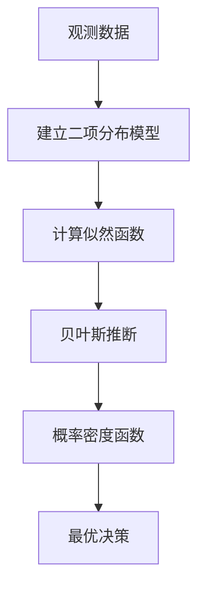
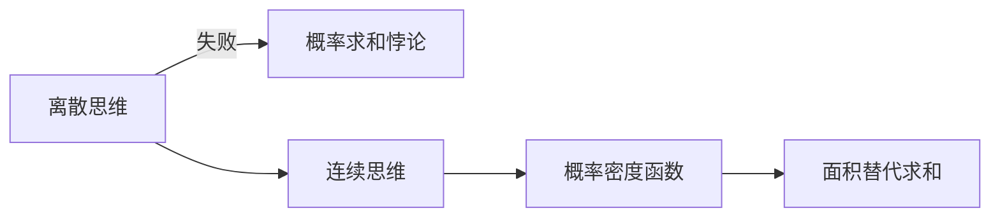
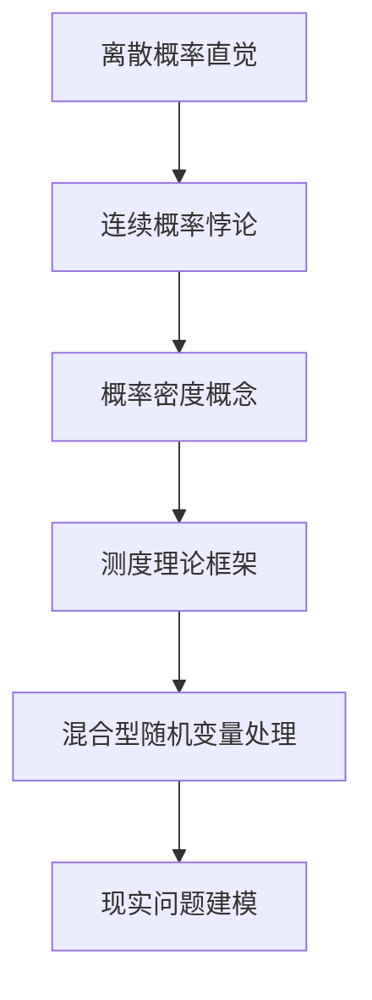
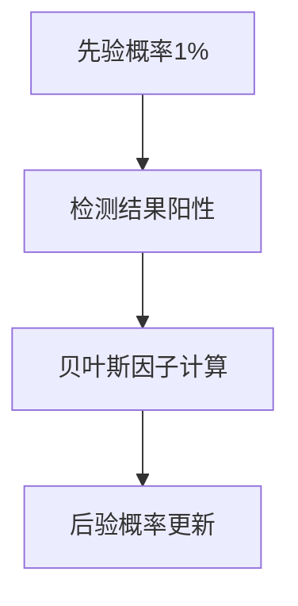

# 概率论系列合集 

# 【01】贝叶斯定理：让概率论更直觉化

## 关键概念与应用场景
- **核心地位**：科学发现的核心工具，AI/机器学习基础，曾用于价值7亿美元的沉船黄金打捞
- **理解层级**：
  1. 公式组成部分
  2. 公式推导过程
  3. 识别应用场景
  4. 重塑思维方式

---

## 经典案例：史蒂夫的职业判断
### 背景设定
- 史蒂夫特征：害羞、整洁、注重细节、不善社交
- 选项对比：图书管理员 vs 农民

### 认知偏差实验
- **卡尼曼与特沃斯基实验**：
  - 多数人选择"图书管理员"（刻板印象匹配）
  - **理性判断应考量**：
    - 先验概率：美国农民与图书管理员比例≈20:1
    - 似然概率：符合特征的群体比例

### 贝叶斯思维推演
```python
假设样本：
- 210人（200农民 + 10图书管理员）
- 符合特征比例：
  - 图书管理员40% → 4人
  - 农民10% → 20人

后验概率 = 4/(4+20) ≈ 16.7%
```

## 贝叶斯定理公式解析

P(H∣E) = P(H) ⋅ P(E∣H) P(E)

### 核心要素

| 术语     | 符号表示 | 案例对应                        |
| :------- | :------- | :------------------------------ |
| 先验概率 | P(H)     | 1/21（图书管理员基础比例）      |
| 似然度   | P(E\|H)  | 40%（图书管理员符合特征的概率） |
| 证据概率 | P(E)     | 24/210（总体符合特征的比例）    |
| 后验概率 | P(H\|E)  | 16.7%（更新后的概率）           |

------

## 几何化理解

```mermaid
graph TD
    A[1x1概率空间] --> B[假设H区域]
    A --> C[证据E区域]
    B --> D[P(H) = 区域宽度]
    C --> E[P(E) = 区域高度]
    B & C --> F[后验概率 = 重叠区域面积比例]
```

------

## 认知升级启示

### 琳达悖论实验

- **描述**：哲学背景+社运经历的琳达更可能：
  1. 银行柜员
  2. 银行柜员+女权主义者
- **实验结果**：
  - 抽象概率判断：85%选②（逻辑错误）
  - 具体数量判断（100人样本）：正确率100%

### 概率直觉训练

1. **具象化思维**：用具体样本代替抽象百分比
2. **几何化表达**：面积比例替代数字运算
3. **连续性扩展**：适用于连续型假设（如地球质量测量）

------

## 核心要义

> "新证据不应直接决定信念，而应更新既有认知"

### 应用价值

- 科学研究：模型验证
- 人工智能：信念建模
- 个人成长：思维模式升级

------

## 延展思考

- **先验争议**：情境假设影响基础概率判断
- **似然争议**：特征匹配度的主观性
- **理性本质**：识别相关参数 > 精确计算

【完整推导过程与连续型案例解析详见下期视频】

# 【02】贝叶斯定理的简洁证明

## 核心公式与推导逻辑
$$
P(A|B) = \frac{P(B|A) \cdot P(A)}{P(B)}
$$

### 联合概率的双向表达
```math
P(A \cap B) = P(A) \cdot P(B|A) = P(B) \cdot P(A|B)
```

**推导本质**：通过两种视角解构"且"概率的对称性

------

## 关键证明步骤

### 1. 联合概率的两种计算方式

- **A优先视角**：先发生A的概率 × 在A发生下B的条件概率
- **B优先视角**：先发生B的概率 × 在B发生下A的条件概率

### 2. 对称性等式建立

P(A) ⋅ P(B∣A) = P(B) ⋅ P(A∣B)

### 3. 条件概率公式推导

P(A∣B) = P(B∣A)⋅ P(A) P(B)

------

## 独立与相关事件对比

| 特征             | 独立事件           | 相关事件                  |
| :--------------- | :----------------- | :------------------------ |
| **条件概率关系** | P(B\|A) = P(B)     | P(B\|A) ≠ P(B)            |
| **联合概率公式** | P(A∩B) = P(A)·P(B) | P(A∩B) = P(A)·P(B\|A)     |
| **典型案例**     | 连续抛硬币/骰子    | 遗传疾病风险/现实决策问题 |
| **数学处理难度** | 简单（乘积即可）   | 需要条件概率修正          |

------

## 经典误区解析

### 心脏病遗传风险案例

> "兄弟两人均患心脏病概率 ≠ 1/4 × 1/4"

**错误根源**：

- 忽视遗传因素导致的条件概率关联
- 错误假设疾病发生相互独立

**正确计算**：

```math
P(兄弟患病|你患病) > P(兄弟患病)
∴ 联合概率需用条件概率修正
```

------

## 贝叶斯定理的本质价值

### 数学层面

- 建立双向条件概率的转换桥梁
- 揭示概率系统的内在对称性

### 应用层面

- 处理现实世界中普遍存在的**条件依赖**关系
- 突破传统独立事件模型的局限性
- 为复杂系统建模提供关键工具

------

## 认知升级启示

### 教学反思

- 传统概率教学过度依赖独立事件案例（骰子/硬币）
- 实际应用场景多涉及条件依赖关系
- 贝叶斯定理正是连接理想模型与现实世界的桥梁

### 思维训练

1. 遇到联合概率问题时，主动质疑独立性假设
2. 建立双向条件概率的转换意识
3. 在复杂系统中寻找条件依赖链

> "真正的概率思维始于认识到：世界是由相互关联的事件编织而成的网络。" —— 概率论核心洞见

# 【03】概率的概率（一）：二项分布深度解析

## 在线卖家选择的数学困境
### 案例背景

假设有三个卖家提供相同商品：

- **卖家A**：10次评价，100%好评
- **卖家B**：50次评价，96%好评（48/50）
- **卖家C**：200次评价，93%好评（186/200）

### 核心问题

**如何量化评价数据置信度？**
直觉认知：

- 数据量越大 → 评分可信度越高
- 100%评分需警惕（小样本效应）

------

## 拉普拉斯连续法则（18世纪经典方法）

### 修正公式

修正好评率=好评数+1总评价数+2修正好评率=总评价数+2好评数+1

### 应用案例

| 卖家 | 原始数据 | 修正计算        | 修正好评率      |
| :--- | :------- | :-------------- | :-------------- |
| A    | 10/10    | (10+1)/(10+2)   | 11/12 ≈ 91.7%   |
| B    | 48/50    | (48+1)/(50+2)   | 49/52 ≈ 94.2%   |
| C    | 186/200  | (186+1)/(200+2) | 187/202 ≈ 92.6% |

**结论**：最优选择卖家B（需理解其数学基础）

------

## 二项分布数学模型

### 核心假设

1. 每次交易为独立事件
2. 存在固定成功概率*s*（真实好评率）
3. 观测数据为*k*次成功/*n*次试验

### 概率质量函数

P(k∣s) = [n k]' s^k (1−s) ^ (n−k)

#### 公式解析

| 项          | 数学含义             | 案例（卖家B） |
| :---------- | :------------------- | :------------ |
| (n k)'      | 组合数（成功路径数） | (50 48)'=1225 |
| s^k         | 成功概率累积效应     | s^48          |
| (1−s)^(n−k) | 失败概率累积效应     | (1−s)^2       |

------

## 概率可视化分析

```python
# 模拟代码示例（卖家B的48/50好评）
import numpy as np
import matplotlib.pyplot as plt

s = 0.95  # 假设真实成功率
simulations = 100000
results = np.random.binomial(50, s, simulations)

plt.hist(results, bins=50, density=True)
plt.axvline(48, color='r', linestyle='dashed')  # 标记观测值
plt.title('50次试验的二项分布模拟（s=0.95）')
plt.show()
```

### 关键观察

1. **峰值位置**：当s=0.96*s*=0.96时，48/50的概率最大
2. **置信区间**：数据量越大 → 分布曲线越集中
3. **极端值分析**：
   - *s*=1时，出现两差评概率为0
   - *s*=0.8时，出现48/50概率≈0.1%

------

## 现实世界应用场景

### 质量检测案例

某汽车厂测试100辆车，发现2辆缺陷：

- **传统误区**：直接推断缺陷率2%
- **正确思路**：建立缺陷率的概率分布模型

### 核心挑战

1. 从离散观测值推断连续概率参数
2. 量化不确定性范围（置信区间）
3. 预测大规模生产的质量风险

------

## 认知升级路线图



> "数据不是真理，而是通向真理的线索" —— 概率思维的核心要义

【深入贝叶斯更新与连续概率分析，请见第二部】

# 【04】概率的概率（二）：连续概率的本质探索

## 加权硬币的哲学困境
### 问题设定

假设存在一枚未知权重硬币：

- 抛掷10次出现7次正面
- 核心问题：硬币真实正面概率h=0.7*h*=0.7的可能性是多少？

------

## 连续概率的数学悖论

### 离散与连续的根本差异

| 维度         | 离散概率               | 连续概率                  |
| :----------- | :--------------------- | :------------------------ |
| **取值空间** | 可数集合（如骰子点数） | 不可数连续区间（如[0,1]） |
| **单点概率** | 非零值（如骰子1/6）    | 恒为零                    |
| **概率计算** | 直接求和               | 积分求面积                |

### 悖论核心

math

复制

```
\text{若} \ P(h=0.7) > 0 \ ⇒ \sum_{h∈[0,1]} P(h) = ∞ \quad \text{(矛盾)}
\text{若} \ P(h=0.7) = 0 \ ⇒ \sum_{h∈[0,1]} P(h) = 0 \quad \text{(矛盾)}
```

------

## 概率密度函数（PDF）的突破性解

### 核心思想转换



### PDF关键特性

1. **区域概率**：P( a ≤ h ≤ b)=∫ab f(h) dh
2. **单位量纲**：概率/单位长度（密度概念）
3. **全域归一**：∫−∞∞ f(h) dh = 1

### 哲学启示

> "在连续概率中，可能性的本质不是『存在概率』，而是『存在概率密度』"

------

## 测度理论的桥梁作用

### 混合型随机变量示例

```python
import numpy as np
import matplotlib.pyplot as plt

def mixed_distribution():
    if np.random.rand() < 0.5:
        return 0  # 离散点
    else:
        return np.abs(np.random.normal(0, 1))  # 连续分布

# 生成10万样本可视化
samples = [mixed_distribution() for _ in range(100000)]
plt.hist(samples, bins=50, density=True)
plt.title('混合型随机变量分布')
plt.show()
```

### 测度理论三大支柱

1. **可测集合**：合法定义概率的集合类型
2. **σ-代数**：集合操作封闭性保证
3. **测度函数**：统一离散与连续的度量工具

------

## 现实应用启示

### 加权硬币问题再思考

1. **正确提问**：*P*(0.6≤*h*≤0.8) 而非 *P(h*=0.7)
2. **解决方案**：构建后验概率密度函数 f(h∣data)
3. **计算工具**：贝叶斯定理 + 概率密度积分

### 工业质检案例延伸

```
初始测试：100辆汽车发现2个缺陷
核心问题：P(真实缺陷率∈[1.5%,2.5%]) = ?
解决方案：建立缺陷率的概率密度分布模型
```

------

## 认知升级路线



> "数学的进步，往往始于重新定义'可能'的规则" —— 概率论发展启示录

【深入概率密度函数构建与贝叶斯推断，请见第三部】

# 【05】医学检测的贝叶斯悖论：重新定义概率认知

## 核心悖论揭示

高精度医学检测的预测困境：

- **检测准确率**：灵敏度90% + 特异度91%
- **现实结果**：阳性预测值仅≈9.1%（1/11）
- **悖论本质**：准确率≠预测价值

------

## 经典乳腺癌筛查案例

### 数据模拟（1000人样本）

| 人群分类          | 患癌组（10人） | 健康组（990人） |
| :---------------- | :------------- | :-------------- |
| **真阳性/假阴性** | 9 / 1          | -               |
| **假阳性/真阴性** | -              | 89 / 901        |

### 关键计算

$$
PPV = \frac{真阳性}{总阳性} = \frac{9}{9+89} ≈ 9.1\%
$$

------

## 贝叶斯思维四步法



### 核心概念对比

| 术语       | 定义              | 案例值 |
| :--------- | :---------------- | :----- |
| 灵敏度     | 患者检测正确率    | 90%    |
| 特异度     | 健康者检测正确率  | 91%    |
| 假阳性率   | 健康者误诊率      | 9%     |
| 贝叶斯因子 | 灵敏度 / 假阳性率 | 10     |

------

## 几率革命：重新理解贝叶斯更新

### 概率 ↔ 几率转换公式

$$
\text{概率} = \frac{\text{几率}}{1+\text{几率}} \quad \text{几率} = \frac{\text{概率}}{1-\text{概率}}
$$

### 动态更新演示

| 场景               | 先验概率 | 转换几率 | 贝叶斯因子 | 后验几率 | 后验概率 |
| :----------------- | :------- | :------- | :--------- | :------- | :------- |
| 常规筛查（1%）     | 1%       | 1:99     | ×10        | 10:99    | 9.17%    |
| 高风险群体（10%）  | 10%      | 1:9      | ×10        | 10:9     | 52.63%   |
| 超低流行率（0.1%） | 0.1%     | 1:999    | ×10        | 10:999   | 0.99%    |

------

## 两种贝叶斯公式对比

### 传统概率公式

$$
P(病|阳) = \frac{P(阳|病)P(病)}{P(阳|病)P(病) + P(阳|健)P(健)}
$$

### 几率公式（临床更优解）

$$
后验几率 = 先验几率 × \left(\frac{灵敏度}{假阳性率}\right)
$$

#### 公式优势

1. 分离先验信息与检测性能
2. 支持多证据链动态更新
3. 直观反映信息增益强度

------

## 现实启示录

### 医生误判案例

2006年妇科医生研讨会：

- **给定数据**：1%患病率 + 90%灵敏度 +91%特异度
- **错误回答**：52%医生认为阳性准确率90%
- **正确答案**：仅21%医生答对（实际9.1%）

### 认知升级要点

1. **检测本质**：概率更新器，非确定性判断
2. **环境依赖**：相同检测在不同群体中预测价值差异巨大
3. **沟通建议**：应同时报告贝叶斯因子与群体基线风险

> "医学检测的真正价值不在于其准确率，而在于其改变认知的能力" —— 贝叶斯诊断的核心要义

【深入多重检测与症状整合分析，请见续作】