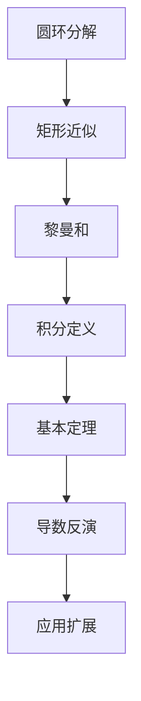
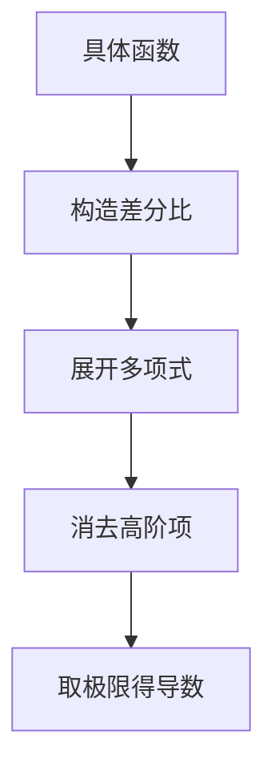
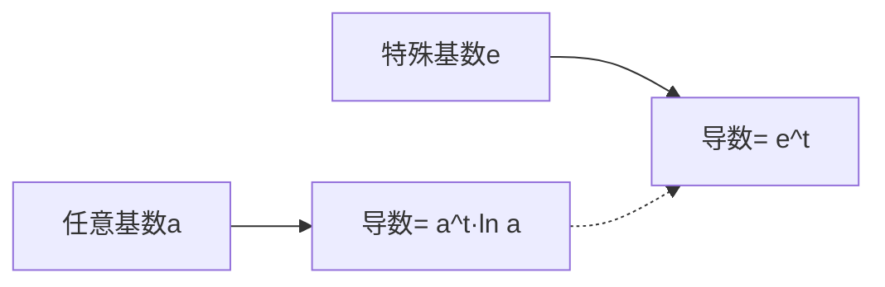
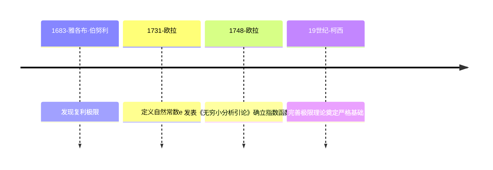
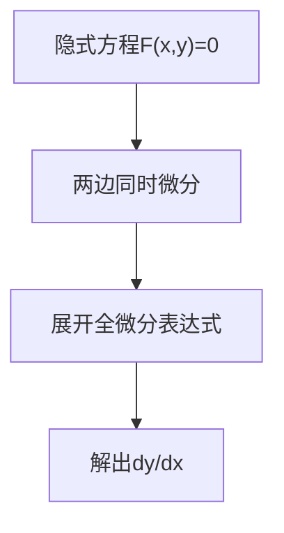
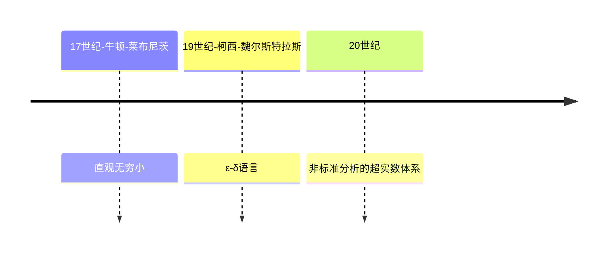
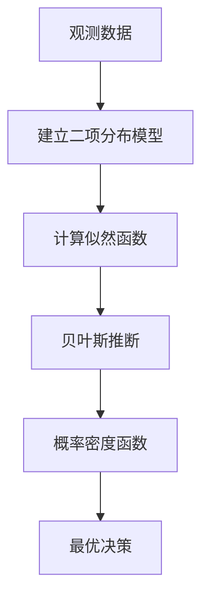
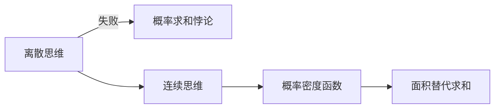
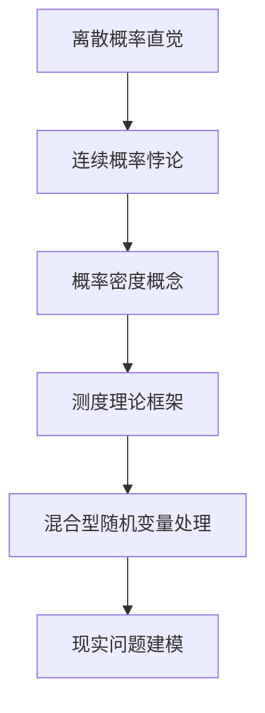
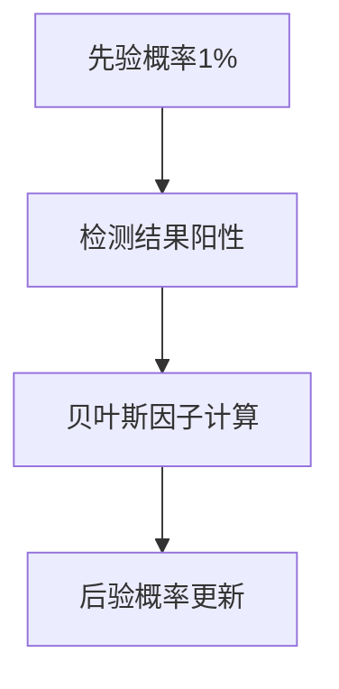

# MathVault - 代数基础 - Algebra Basics

## 学习推荐和内容描述 - Study recommendations and content description:：

## 一、B站UP主“满楼-花”修复的《北大丘维声教授-清华高等代数课程》系列视频教程

## 《Peking University Professor Qiu Weisheng - Tsinghua Advanced Algebra Course》

【北大丘维声教授清华高等代数课程1080P高清修复版(全151集)】- https://www.bilibili.com/video/BV1jR4y1M78W/

个人视频学习笔记 - 《丘维声-Algebra》，内容同视频学习进度一致，可作为辅助学习的手段

### 《高等代数Ⅰ》- 对应【北大丘维声教授清华高等代数课程】 1-75集  包含如下内容：

1. 线性方程组的解法 - Solutions of systems of linear equations 【P1-P4】

2. N阶行列式 - Determinants of order N 【P5-P14】

3. 线性空间 - Linear spaces 【P15-53】

4. 矩阵的运算 - Operations on matrices 【P54-P66】

5. 一元多项式环 - Rings of monomial polynomials 【P67-P78】

### 《高等代数Ⅱ》- 对应【北大丘维声教授清华高等代数课程】 76-151集  包含如下内容：

1. 一元多项式环 - Rings of monomial polynomials 【P1-P7】

2. 线性映射 - Linear mappings 【P8-P42】

3. 双线性函数 - Bilinear functions 【P43-48】

4. 具有度量的线性空间 - Linear spaces with metrics 【P49-P66】

5. N元多项式环,二次型 - N-membered polynomial rings, quadratic 【P67-P71】

## 二、B站UP主“3Blue1Brown”中国官方账号的《Linear Algebra》系列视频教程

【【官方双语/合集】线性代数的本质 - 系列合集】- https://www.bilibili.com/video/BV1ys411472E/

## 3Blue1Brown 线性代数课程笔记

### 【00】序言：线性代数

- **现实应用 (Reality)**：实际用途  
- **计算层面 (Up)**：数值计算工作  
- **基础核心 (Basis)**：几何直观理解  
- **关键联系**：几何直观与数值计算的关联  
- **课程目标**：通过动画直观展示线性代数的几何本质 - 3b1b的目的

> "线性代数紧紧围绕向量加法与数乘展开"

---

### 【01】向量是什么

### 1. 空间中的箭头（物理学视角）

- **特征**：长度与方向  
- **坐标系中的箭头**：以原点为起点  

### 2. 有序数字列表（计算机科学视角）

- **特性**：顺序不可颠倒，维度固定  
  - 示例：`[2,3] ≠ [3,2]`  

### 3. 几何与代数的统一

- **向量本质**：坐标系中的特定运动（方向+距离）  
- **向量加法**：先水平后垂直运动的合成  
- **标量乘法**：数字在线性代数中起到的主要作用就是缩放向量（Scaling）  

```python
# 3b1b 动画引擎
https://github.com/3b1b/manim
```

---

### 【02】线性组合、张成的空间与基

### 核心概念

- **基向量**：`i(1,0)` 与 `j(0,1)`
- **线性组合**：`a𝐯 + b𝐰`（标量a,b缩放向量）
- **张成空间**：所有可能的线性组合集合
  - 二维示例：`span(𝐯,𝐰)` 形成平面
  - 三维示例：添加第三个向量可能扫过全空间

### 线性相关性

| 类型     | 定义                       | 示例          |
| :------- | :------------------------- | :------------ |
| 线性相关 | 某向量可被其他向量线性表示 | `𝐮 = 2𝐯 + 3𝐰` |
| 线性无关 | 无法被其他向量线性表示     | 基向量组      |

> **基的严格定义**：线性无关且能张成全空间的向量集合

------

### 【03】矩阵与线性变换

### 线性变换的本质

- 保持直线性与原点固定
- 网格线保持平行且等距
- **矩阵的几何意义**：记录基向量变换后的位置

### 矩阵表示

```
[ a  b ]  第一列为变换后的i
[ c  d ]  第二列为变换后的j
```

- **向量变换公式（将变换作用于向量(x,y) -> x乘以(a,c)加上y乘以(b,d)）**：
  `(x,y) → (ax+by, cx+dy)`


### 经典变换示例

| 变换类型 | 矩阵          | 效果             |
| :------- | :------------ | :--------------- |
| 旋转90°  | `[0 -1; 1 0]` | 坐标系逆时针旋转 |
| 剪切变换 | `[1 1; 0 1]`  | j向(1,1)移动     |

**Notes**: 将整个空间逆时针旋转90度，那么基向量 i 落在(0,1)上，基向量 j 落在(-1,0)上，因此这个线性变换矩阵的列分别为(0,1)和(-1,0)，对于任意向量在逆时针旋转90度后的位置，只需要把它与矩阵相乘即可

- **"Shear"-"剪切" **: 基向量 i 不变,基向量 j 移动到(1,1)


> "矩阵向量乘法就是计算线性变换作用于给定向量的一种途径"
>
> ▲▲▲【每当看到一个矩阵时，我们都可以把它解读为对空间的一种特定转换】▲▲▲

------

### 【04】矩阵乘法与线性变换复合

> **"关键的一点在于：线性变换由它对空间的基向量的作用完全决定"**

- ##### 复合矩阵应当捕捉到了旋转然后剪切的相同总体效应


### 几何理解

- **矩阵乘法** = 连续线性变换的合成
  - **两个矩阵相乘有着几何意义 - 矩阵乘法意义的来源，也就是两个线性变换相继作用 **
    【习惯性从右往左读】


- **运算顺序**：从右向左作用
  - 示例：**M1M2≠M2M1** - 先穿袜子后穿鞋 ≠ 先穿鞋后穿袜子

> "**良好的解释(Good explanation)**  >  象征性证明(Symbolic proof)"

### 三维扩展

- 每个坐标都可以看作对相应基向量的缩放，因此将坐标和矩阵对应列相乘后再相加即可
  - 【原因：“缩放再相加”的过程在变换前后均适用】


- 三维旋转分解为简单变换的复合 - 易于理解

------

### 【05】行列式

### 几何意义

- **缩放因子**：这个特殊的缩放比例，即线性变换改变面积的比例，被称为这个变换的行列式


- 只需要检验一个**矩阵的行列式是否为0**，就能了解这个矩阵所代表的变换是否**将空间压缩到更小的维度上**


- 对于初始状态，j 帽在 i 帽的左边，如果在变换之后，j 帽处于 i 帽的右边，那么**空间定向**就发生了改变


- 当空间定向改变的情况发生时，行列式为负，但是行列式的绝对值依然表示区域面积的缩放比例
  - 【行列式为负的解释和直观感受】


**以上为二维空间中对行列式的理解，如果在三维空间中可以理解为线性变换改变体积的比例【体积的缩放】**

- 行列式为0则意味着整个空间被压缩为零体积的东西，变成一个平面或一条直线 or 一个点
  - 【行列式为0说明存在向量对向量的张成空间没有任何贡献】

#### **符号意义**：空间定向改变（右手系↔左手系）

- 变换后还能满足**右手定则**，那么定向**没有发生改变**，则**行列式为正**
- 变换后只能满足**左手定则**，那么定向**发生改变**，则**行列式为负**


**对于 [a b]    如果b,c均为0，所以ad给出的是单位正方形伸缩后形成的矩形的面积**
         **[c d]    如果b,c都不为0，那么bc项就会告诉你平行四边形在对角方向上拉伸或压缩了多少 **


### 特性总结

| 维度 | 物理意义     | 零值含义           |
| :--- | :----------- | :----------------- |
| 2D   | 面积缩放比例 | 空间压缩为线/点    |
| 3D   | 体积缩放比例 | 空间压缩为面/线/点 |

> **行列式公式**：
>
> - 二维：`det([a b; c d]) = ad - bc`
> - 三维：平行六面体体积缩放

------

### 【06】逆矩阵、列空间与零空间

### 核心概念

- **逆变换**：将线性变换的效果抵消
- **秩**：列空间的维度（输出空间的维数）
- **零空间**：被压缩到原点的向量集合

**Notes：**在理解线性变换A、vector x、vector v中              -----     Ax = v     -----

​	-- 只要变换A不将**空间压缩到一个更低的维度上**，也就是它的行列式不为零，那么它就存在逆变换

### 线性方程组解的情况

| 条件    | 解的情况    | 几何解释                    |
| :------ | :---------- | :-------------------------- |
| det ≠ 0 | 唯一解      | 空间未被压缩                |
| det = 0 | 无解/无限解 | 空间压缩至低维 - 没有逆变换 |

- **Rank 1**: 当变换的结果为**一条直线**时，结果是一维,变换的秩为1
- **Rank 2**: 如果变换后的向量落在某个**二维平面**上，变换的秩为2
- **Rank 3**: 如果一个三维变换的行列式不为零，变换结果仍旧充满整个**三维空间**，变换的秩为3

> 因此：**Rank(秩) <=> Number of dimensions in the output    ---    "秩"代表着变换后空间的维数   **
>
> 更精确的秩的定义  ==>> **列空间的维数**
>
> 【**满秩**：当秩达到最大值时，意味着秩与列数相等】


- 零向量一定在列空间中，因为**线性变换必须保持原点位置不变！**

- 对一个满秩变换来说，唯一能在变换后落在原点的就是零向量自身

- 变换后落在原点的向量的集合，被称为矩阵的 **"null space-零空间"** 或 **"kernel-核"**
  - 变换后一些向量落在零向量上，而 "零空间" 正是这些向量所构成的空间

#### 【06】逆矩阵、列空间与零空间 --- 总结截图


### 【附注-2】非方阵

对于三行两列矩阵，这个矩阵的列空间是**三维空间中一个过原点的二维平面**

`[3  1]        几何意义：将二维空间映射到三维空间上`
`[4  1]           因为矩阵有两列表明输入空间有两个基向量`
`[5  9]           有三行表明每一个基向量在变换后都用三个独立的坐标来描述`

注：类似的，当我们遇见两行三列的矩阵，即原始空间是三维的，因此这是一个从三维空间到二维空间的变换


> 可以理解为：**矩阵表示一个线性变换，列数表示原始维数，行数表示变换后维数**

------

### 【07】点积与对偶性 - 难 - 建议多看几遍

### 几何解释

- **投影关系**：`𝐯·𝐰 = |𝐯||𝐰|cosθ`
  - 当两个向量的**指向大致相同**时，他们的**点积为正 - Similar directions【v * w ＞ 0】**
  - 当它们**相互垂直**时，意味着一个向量在另一个向量上的**投影为零向量 - Perpendicular【v * w = 0】**
  - 当它们的**指向基本相反**时，他们的**点积为负 - Opposing directions**


##### **=== 点积与顺序无关 ===**

将 v 放大为原来的两倍并不改变 w 的投影长度，但是被投影的向量长度变为原来的两倍

> 因此：缩放向量对点积结果的影响是相同的【见截图-如下】


- 如果你有一系列**等距分布**于一条直线上的点，然后应用变换，线性变换会**保持这些点等距分布在输出空间中**，也就是数轴上，否则，**如果这些点没有等距分布，那么这个变换就不是线性的**


- **对偶性**：向量 ⇌ 线性变换
  - **Explain**：通过向量 u 定义了一个投影矩阵，对应一个线性变换，此矩阵的列就是变换后 i 和 j 的位置，即 i 和 j 在 u 的投影，根据对称性，i 在 u 的投影等于 u 在 x 轴的投影，投影矩阵就是[ux uy]

而**空间中任意向量经过投影变换的结果**，也就是**投影矩阵与这个向量相乘**，其**结果完全等同于点积**

> 这就是为什么与单位向量的点积可以解读为：**将向量投影到单位向量所在的直线上所得到的投影长度**

### 重要结论

- 点积 = 投影长度 × 被投影向量长度
- 矩阵乘法视角：`[ux uy]` 作为投影矩阵


> 这就是为什么向量与给定非单位向量的点积可以解读为：
>
> ​            **"首先朝给定向量上投影，然后将投影的值与给定向量长度相乘"**

- **启发**：在任何时候看到一个线性变换，它的输出空间是一维数轴，无论它是如何定义的，空间中会存在唯一的向量 v 与之相关 --------【就这一意义而言，应用变换和与向量 v 做点积是一样的】

#### Summary：

- 表面上看，点积是理解投影的有利几何工具，并且方便检验两个向量的指向是否相同
- 更高级的看，两个向量点乘，就是将其中一个向量转化为线性变换

> 重要理解：**不把向量看作空间中的箭头，而看作线性变换的物质载体**

### 【08】叉积

### 标准定义

- **几何意义**：有向面积（右手定则）

- **计算公式**：
  `𝐯×𝐰 = det([i j; v1 v2])`（二维扩展）

  - **顺序影响叉积结果：vector v × vector w = - vector v × vector w**

  - 如果 v 在 w 的**右侧**，那么 v 叉乘 w 为**正**，并且值等于**平行四边形的面积**（如下图）

  - 如果 v 在 w 的**左侧**，那么 v 叉乘 w 为**负**，即值等于**平行四边形面积的相反数**


实际上，**基向量的顺序就是定向的基础：vector i × vector j = +1**

- 向量的长度就是平行四边形的面积，向量的方向与平行四边形（所在的面）垂直，右手法则定方向


### 线性变换视角 - 重在反复观看理解

- 叉积矩阵对应三维空间中的体积变换
- 对偶向量：唯一对应三维→一维的线性变换
- **整体计划：解释清楚叉积的计算过程和几何含义之间的关系**


### 【09】基变换

### 核心概念

> **隐含假设**：坐标系的默认基底是标准基向量 `i` 和 `j`  


- **基的选择依赖性** - 不同的表示
  - 向量的空间描述依赖于所选基底  


- **坐标系间转化**  
  - **语言之间的转化 **- 如何在坐标系之间对单个向量的描述进行相互转化
  - 关键步骤：  
    1. 原始基 → 新基  
    2. 应用变换  
    3. 新基 → 原始基  


- #### **矩阵变换的跨基描述**  

  - **表达式 `A⁻¹MA` 的几何意义**：  
    - **`M`：原始坐标系中的变换  **
    - **`A` 和 `A⁻¹`：视角转换工具  **

> **"同一变换在不同基下具有不同矩阵形式，但核心作用不变"**


---

### 【10】特征向量与特征值 - 直观 - 封神的一集

> **"通常而言，对特征的东西感到疑惑，更多的是因为众多预备知识的薄弱基础，而不是在于特征向量   与特征值本身，需要极强的逻辑链来向后学习和证明"**
>
> ​                                                                                                              **—————— 3Blue1Brown**


**此时除了对角线和x轴，任何其他向量在变换中都有或多或少的旋转**


### 直观理解

- **特征向量的定义**  
  - 在线性变换中**保持方向不变的向量 ** =>  "特征向量"
  - **特征值**：衡量特征向量在变换中拉伸或压缩比例的因子


- **三维旋转的视角**  
  - 绕轴旋转的直观性 > 3x3矩阵描述  
  - **旋转的特征值必为1（因为旋转并不缩放任何一个向量）  **

> **"理解线性变换作用的关键往往较少依赖于你的特定坐标系，更好的方法是求出它的特征向量和特征值"**


#### 计算的相关概念


### 计算与应用

- #### **关键条件**  

  | 条件       | 几何解释           | 数学表达          |
  | ---------- | ------------------ | ----------------- |
  | 存在非零解 | 空间被压缩到低维   | `det(A - λI) = 0` |
  | 行列式为零 | 空间压缩的量化指标 | `det(M) = 0`      |


> **Notes：当且仅当矩阵代表的变换将空间压缩到更低的维度时，才会存在一个非零向量，使得矩阵和它的乘积为零向量，而空间压缩对应的就是矩阵的行列式为零**


- 二维线性变换不一定有特征向量，如果非要计算它的特征值，就会发现没有实根
  - **没有实数解表明它没有特征向量**

- **对角矩阵的特性**  
  - 所有基向量都是特征向量  
  - 矩阵的对角元是它们所属的特征值


- **基变换与对角化**  

  ```math
  [新基矩阵]⁻¹ [原始矩阵] [新基矩阵] = 对角矩阵
  ```

- **特征基**：由特征向量构成的一组基

- 对角化条件：足够多的线性无关特征向量

> **Notes**：对一个矩阵，取出你想用作新基的向量的坐标【用特征向量作为基】，然后将坐标作为一个矩阵的列，这个矩阵就是基变换矩阵【结合上一节09的知识】，当你将原始的变换夹在两个矩阵中间时，所得的矩阵代表的是同一个变换，不过是从新基向量所构成的坐标系的角度来看的


- 用特征向量来完成这件事的意义在于：这个**新矩阵必然是对角的，并且对角元为对应的特征值     **
  - 【这是因为，它所处的坐标系的基向量在变换中只进行了缩放】

> **Notes**：可惜的是并非所有矩阵都能对角化，可能它的特征向量不够多，并不能张成全空间，但是如果你能找到一组特征基，矩阵运算就会变得非常轻松


------

### 【11】抽象向量空间

### 核心思想

- **与坐标系无关的性质**
  - 行列式 → 空间缩放比例
  - 特征向量 → 变换中保持方向的向量

> "这二者都是暗含于空间中的性质，你可以自由选取坐标系，这并不会改变它们最根本的值"


- #### **线性的严格定义**

  满足以下两条性质：

  1. **可加性**：`L(v + w) = L(v) + L(w)`
  2. **齐次性**：`L(cv) = cL(v)`


> "**网格线保持平行且等距分布**的概念，只是这两条性质在二维空间这一特殊情况下的体现"
>
> 这两条性质的一个最重要的推论是：**一个线性变换可以通过它对基向量的作用来完全描述，这使得矩阵向量乘法成为可能**

### 函数空间的拓展

- **无限维向量空间**
  - 多项式函数空间
  - 求导操作 → 无限阶矩阵描述


- **概念对应表** - 概念里的名称可能不同

  | 线性代数概念 | 函数空间对应名称 |
  | :----------: | :--------------: |
  |   线性变换   |     线性算子     |
  |     点积     |       内积       |
  |   特征向量   |     特征函数     |


- **向量空间的描述**


- **向量空间公理** - 向量加法和数乘的规则

  ```
  1. 加法交换律：u + v = v + u  
  2. 数乘结合律：a(bv) = (ab)v  
  3. 分配律：a(u + v) = au + av  
  （共8条公理 - 见如下截图）
  ```


> **Notes**：这些公理并非基础的自然法则，它们是一个媒介，一边连接着你，也就是发现这些结论的数学家，另一边连接着其他人，也就是想要把这些结论应用于新的向量空间的人

------

### 【12】克莱姆法则的几何解释

### 学习建议

- **融会贯通**：结合行列式几何意义理解
- **分步抽象**：从具体案例推广到一般情况
- **关键图示**：面积/体积比值与解的关系

------

## =======================3B1B 学习建议=======================

##### **★★★★★★★★★★★★★★★★★★★★★★★★ 具象与抽象的平衡 ★★★★★★★★★★★★★★★★★★★★★★★★★**

- 推荐进行**有形的思考 - 从具象到抽象**

  - 有的人偏向于**记忆性学习**，先记后**在运用的过程中不断理会**

  - 有的人倾向于**先理解后记忆**，**在理解的基础上不断强化巩固**

但对于**抽象的数学**，进行**有形的思考和直观地感受**所带来的乐趣，才是推动学习者学习下去的动力 - 于我而言

**普适的代价是抽象**，而**形象的代价是狭隘**，这也是目前教科书中和课堂上更倾向于抽象表述的根本原因，二者并不冲突，对大多数人而言，并行也许才能走得更远，因为如果我们具备了正确的直观，我们会在以后的学习中更加高效，去解决问题从而不断学习

## =======================================================


## 3Blue1Brown 线性代数代码运行动画展示

### 1、示例1-向量表示与线性组合.py

### 2、示例2-矩阵变换(剪切变换).py

### 3、示例3-行列式几何意义.py

### 4、示例4-特征向量可视化.py

### 详细见：代码运行步骤指南.md


#  MathVault - 微积分本质 - Essence of Calculus

## 一、B站UP主“3Blue1Brown”中国官方账号的《Calculus》系列视频教程

【【官方双语】微积分的本质 - 01 -】- https://www.bilibili.com/video/BV1cx411m78R/

## 3Blue1Brown 微积分课程笔记

## 【01】微积分的本质

### 🌟 核心发现：几何与积分的深刻联系

#### 1. 圆面积公式的几何重构

##### 🔍 分析方法

- **同心圆环分解**：将圆分解为无数同心圆环（半径r∈[0,3]）

- **单环近似展开**：每个环展开为矩形（周长2πr × 厚度dr）

- **整体面积求和**：
  $$
   \sum 2πr·dr  → 积分  \int_0^3 2πr\ dr 
  $$

##### 📐 几何转换

- **面积三角形化**：积分转换为底3高6π的三角形面积

- **公式推导**：
  $$
  S = \frac{1}{2}×3×6π = 9π = πR^2
  $$

#### 2. 积分本质的几何启示

##### 💡 关键认知

- **微观求和 → 宏观图形**：无限细分求和转化为函数图像下面积

- **普适性应用**：适用于速度-时间积分求位移等各类累积问题

- **积分函数定义**：
  $$
  A(x) = \int_0^x t^2 dt
  $$
  （抛物线x²下的面积）

#### 3. 导数与积分的舞蹈

##### 🎭 基本定理可视化

| 现象         | 数学表达 | 几何解释                     |
| ------------ | -------- | ---------------------------- |
| 面积微分变化 | 公式1    | 微小增量dx对应面积条带≈x²·dx |
| 导数本质     | 公式2    | 积分函数的导数恢复原函数     |
| 互逆关系     | 公式3    | 微积分的阴阳统一             |

数学表达 - 公式1：
$$
\frac{dA}{dx} \approx x^2
$$
数学表达 - 公式2：
$$
A'(x) = x^2
$$
数学表达 - 公式3：
$$
\frac{d}{dx} \int_0^x f(t)dt = f(x)
$$


#### 4. 重要概念网络



### 📚 深度洞见

#### 1. 数学思维范式

- **近似艺术**：dr越小，环→矩形近似越精确

- **维度跃迁**：一维线积分（周长）→ 二维面积

- **无限细分哲学**：
  $$
  lim⁡dr→0∑2πr⋅dr=∫0R2πrdr
  $$

#### 2. 核心公式演化

$$
离散求和→连续积分<==>∑r=032πrΔr→∫032πr dr
$$

$$
{ 三角形面积→圆面积公式<==>
12×底×高→πR2 }
$$

#### 3. 思维训练要点

- **逆向工程思维**：从导数反推原函数（反向破解积分）
- **几何代数统一**：图形面积 ↔ 符号积分 ↔ 导数关系
- **误差控制艺术**：掌握何时可忽略高阶无穷小（如dr²项）

### 🧭 学习导航

#### 1. 概念衔接地图

```python
   圆环分解 → 黎曼和 → 积分定义
　　　↓　　　　  ↓
 同心对称性 → 函数图像 → 导数关系
　　　　　　　   ↓
　　　  　基本定理深度理解
```

#### 2. 关键问题反思

- 为何选择同心圆环而非其他分割方式？
- 当dr→0时，环厚度误差如何消失？
- 基本定理如何统一微观变化与宏观累积？

#### 3. 扩展思考挑战

- 尝试用梯形近似代替矩形近似，误差变化规律？
- 将圆环改为扇形分割，积分形式如何变化？
- 对于椭圆面积，此方法需要做哪些调整？

> "数学不是观赏运动，真正的理解来自亲手拆解与重构。" —— 本系列核心教学理念

图示思考建议：同心圆展开过程、黎曼和演化、导数-积分循环关系

## 【02】导数悖论深度解析与学习笔记

### 🌀 核心悖论：瞬时变化率的矛盾性

#### 1. 哲学困境

- **「瞬时」与「变化」的天然矛盾**：
  - 变化需时间间隔，而「瞬时」意味着零时间跨度
  - 例：汽车在单一时刻的速度测量不可行

#### 2. 现实世界的解决方案

| 现实测量             | 数学对应     | 核心思想               |
| -------------------- | ------------ | ---------------------- |
| 车速表测量0.01秒位移 | 公式4        | 用微小时间间隔逼近瞬时 |
| 连续拍摄两张照片     | 切线斜率近似 | 通过相邻点斜率预测趋势 |

数学表达 - 公式4：
$$
\frac{Δs}{Δt} \ (Δt=0.01s)
$$
图示思考建议：Δt逐渐缩小的位移测量过程

## 📐 导数本质的几何诠释

#### 1. 动态极限过程


#### 2. 代数实例：t³函数的导数推导

- **函数**：
  $$
  s(t)=t^3
  $$

- **微分过程**：

$$
\frac{ds}{dt} = \lim_{\Delta t \to 0} \frac{(t + \Delta t)^3 - t^3}{\Delta t}

= \lim_{\Delta t \to 0} [3t^2 + 3t\Delta t + (\Delta t)^2]

= 3t^2
$$

- **关键步骤**：
  - 展开立方差公式
  - 消除Δt高阶项（Δt^2等）
  - 取极限后仅保留线性项

#### 3. 导数几何意义

- **切线斜率**：导数即函数图像在某点的切线斜率
- **最佳线性近似**：在微小邻域内用直线最佳逼近曲线变化

### 💡 思维训练与认知突破

#### 1. 经典悖论解析：t=0时汽车是否运动？

| 视角         | 结论                   | 本质解析                 |
| :----------- | :--------------------- | :----------------------- |
| 导数计算     | *v*(0)=0               | 瞬时变化率的数学描述     |
| 实际观测     | 0→0.1*s*移动0.001m     | 微观位移的客观存在       |
| **认知突破** | 不存在「瞬时运动」概念 | 导数描述的是最佳线性近似 |

#### 2. 导数理解框架

- **正确认知**：

  - 不是真正的「瞬时速度」
  - 而是「最佳恒定速度近似」

- **数学表达**：

$$
v(t) = \lim_{\Delta t \to 0} \frac{s(t+\Delta t)-s(t)}{\Delta t}
$$

#### 3. 常见误区警示

- **无穷小量陷阱**：dt≠0，始终为有限小量
- **现实测量局限**：任何物理测量都有最小时间单位
- **数学抽象优势**：通过极限过程突破测量限制

### 🧮 导数计算技术要点

#### 1. 通用计算流程

1. 构造差分比 Δs/Δt
2. 展开代数表达式
3. 消除Δt高阶项
4. 取Δt→0极限

#### 2. 典型函数导数速记

| 函数类型 | 导数规律         | 示例        |
| :------- | :--------------- | :---------- |
| 幂函数   | (t^n)′=n t^(n−1) | (t^3)′=3t^2 |
| 常数函数 | (*C*)′=0         | (5)'=0      |
| 线性函数 | (kt)′=k          | (2t)'=2     |

#### 3. 导数计算思维导图



### 📖 延伸思考与学习建议

#### 1. 哲学思辨练习

- Zeno悖论与导数概念的关系
- 量子力学中的最小时间单位对导数理论的影响

#### 2. 应用联想训练

- 经济学的边际成本分析
- 物理学的瞬时加速度测量
- 生物学的种群增长率模型

#### 3. 学习资源推荐

- **《微积分之屠龙宝刀》**：导数概念的趣味解读
- **3Blue1Brown「微积分本质」系列**：可视化导数理解
- **AoPS微积分课程**：系统构建导数知识体系

> "导数是人类智慧在无穷小领域的精妙舞蹈——既需严谨的数学步伐，又需诗意的哲学想象。" —— 本讲核心启示

## 【03】用几何方法求导的关键概念与学习笔记

### 📚 核心概念

#### 导数的重要性

- **现实建模**：多项式/三角函数/指数函数等抽象函数的导数能力，是分析现实现象的关键数学语言
- **本质理解**：导数本质是考察输入量的微小变化(dx)与输出量变化(df)的关系，而非单纯记忆规则

### 📐 几何求导案例解析

#### 1. 函数 f(x) = x²

##### 🔍 几何分析：

- 正方形面积模型：边长为x → 面积x²

- 边长增加dx后新增面积分析：

  - 2个长方形面积：2 * x * dx 
  - 极小正方形面积：dx²（可忽略）

- **导数公式**：
  $$
  \frac{d}{dx}x^2 = 2x
  $$

##### 💡 关键理解：

- 当dx趋近0时，高阶项(dx²)可忽略
- 实例：x=3时，df/dx=6（每增加1单位x，面积增加6单位）

---

#### 2. 函数 f(x) = x³

##### 🔍 几何分析：

- 立方体体积模型：边长为x → 体积x³

- 边长增加dx后新增体积分析：

  - 3个薄立方体体积：3 * x² * dx
  - 边缘和角落体积（含dx²/dx³项，可忽略）

- **导数公式**：
  $$
  \frac{d}{dx}x^3 = 3x^2
  $$

##### 💡 关键理解：

- 主要增量来自三个可见面
- 实例：x=2时，df/dx=12（每增加1单位x，体积增加12单位）

---

#### 3. 幂函数通式 xⁿ

##### 🔍 模式总结：

- **幂法则**：对任意指数n
  $$
  \frac{d}{dx}x^n = nx^{n-1}
  $$

- **几何解释**：

  - 展开(x+dx)^n时，主要增量项为n个x^{n-1}dx
  - 高阶项（含dx²及以上）可忽略

---

#### 4. 函数 f(x) = 1/x

##### 🔍 几何分析：

- 矩形面积模型：宽x → 高1/x（保持面积1）

- 宽度增加dx时：

  - 新增右侧面积：1/x * dx
  - 需减少的高度d(1/x)：保持总面积不变

- **导数公式**：
  $$
  \frac{d}{dx}(\frac{1}{x}) = -\frac{1}{x^2}
  $$

##### 💡 思考练习：

- 对比幂法则（x⁻¹）与几何分析结果的一致性

---

#### 5. 三角函数 sinθ

##### 🔍 单位圆分析：

- 定义：单位圆上弧长θ对应点的y坐标

- 微小增量dθ分析：

  - 沿圆周移动形成直角三角形
  - 高度变化d(sinθ)与邻边/斜边比值 = cosθ

- **导数公式**：
  $$
  \frac{d}{dθ}sinθ = cosθ
  $$

##### 💡 双重理解：

1. 图形直觉：导数波形与cosθ完全吻合
2. 几何证明：通过相似三角形关系严格推导

---

### 🧠 重要思维训练

1. **微小增量原则**：
   - 始终关注主导变化项（与dx线性相关）
   - 自动忽略高阶无穷小（dx²及以上）

2. **可视化思维**：
   - 正方形/立方体 → 多项式函数
   - 单位圆 → 三角函数
   - 面积约束 → 倒数函数

3. **扩展思考**：
   - √x 的导数几何推导（挑战题）
   - cosθ 的导数推导（相似单位圆方法）

---

### 📝 学习建议

- **避免符号操作惯性**：每次求导时联想几何意义
- **建立数学直觉**：用图形化思维理解公式背后的空间关系
- **主动探索**：尝试用相同方法推导其他函数（如建议的√x和cosθ）

> 注：所有公式推导均基于对微小变化量dx的几何分析，核心思想是将复杂函数转化为可视图形的增量分析。这种思维方式是微积分理解的精髓，远胜于机械记忆求导规则。

## 【05】指数函数求导本质解析与学习笔记

### 🌟 指数函数导数的核心发现

#### 1. 基本观察：指数函数的自相似性

- **人口增长模型**：以2^t表示种群质量（t为天数）

  - t=0时质量1，t=1时2，t=2时4，呈指数增长

  - **日增长率**：
    $$
    \frac{Δm}{Δt} = 2^t（与当前质量成正比）
    $$

#### 2. 导数悖论的突破

| 观察维度     | 离散时间         | 连续时间（dt→0）     |
| ------------ | ---------------- | -------------------- |
| 变化率计算   | 公式5            | 公式6                |
| 结果特点     | 精确等于当前值   | 比例常数×当前值      |
| **关键突破** | 宏观时间尺度规律 | 微观极限下的比例关系 |

数学表达 - 公式5：
$$
\frac{2^{t+1}-2^t}{1} = 2^t
$$
数学表达 - 公式6：
$$
\lim_{dt→0} \frac{2^{t+dt}-2^t}{dt}
$$
图示思考建议：展示2^t曲线在不同点的切线斜率变化

### 📐 数学推导与自然常数e

#### 1. 通用导数公式推导

- **指数分解**：
  $$
  a^{t+dt} = a^t \cdot a^{dt}
  $$

- **导数表达式**：
  $$
  \frac{da^t}{dt} = a^t \cdot \lim_{dt→0} \frac{a^{dt}-1}{dt}
  $$

- **比例常数发现**：
  $$
  \lim_{dt→0} \frac{a^{dt}-1}{dt} = \ln a
  $$

#### 2. 自然常数e的独特地位



#### 3. 关键公式总结

| 函数   | 导数        | 特性     |
| :----- | :---------- | :------- |
| *e^t*  | *e^t*       | 自导性   |
| *a^t*  | *a^t* ln*a* | 比例常数 |
| *e^kt* | *k*e^kt     | 链式法则 |

### 🔍 深度认知与思维突破

#### 1. 自然对数的本质揭示

- **定义式**：*a*=*e*^ln*a*
- **导数转换**：2^*t*=*e^t*ln2 ⇒ d/dt 2t=ln2 ⋅ 2^*t*
- **计算验证**：ln⁡2≈0.6931，ln⁡8=3ln⁡2≈2.079

#### 2. 应用意义解析

- **自然选择**：以e为底时比例常数为1，简化计算
- **实际建模**：种群增长/冷却定律/复利计算均符合dy/dt=ky
- **统一表达**：y=e^kt直接反映增长率k

### 🧮 导数计算技术手册

#### 1. 计算步骤框架

1. 表达式转换：a^t→e^tln⁡a
2. 应用链式法则：d/dt e^kt = ke^kt
3. 代数整理：k=ln⁡ a

#### 2. 典型实例演算

**案例**：求 5^t 的导数
$$
1. 5^t = e^{t \ln 5}
$$

$$
\frac{d}{dt} e^{t \ln 5} = \ln 5 \cdot e^{t \ln 5}
$$

$$
简化得：\frac{d}{dt} 5^t = 5^t \ln 5
$$

#### 3. 常见基数比例常数

| 基数 | 比例常数 | 计算式 |
| :--- | :------- | :----- |
| 2    | 0.6931   | ln⁡2    |
| 3    | 1.0986   | ln⁡3    |
| 10   | 2.3026   | ln⁡10   |
| e    | 1        | ln⁡ e=1 |

### 💡 思维延展与高阶认知

#### 1. 哲学启示

- **自相似性**：指数函数在任意尺度保持结构不变
- **微观决定论**：瞬时变化率决定长期演化轨迹
- **自然常数本质**：e是时空连续性的数学结晶

#### 2. 应用联想训练

- **病毒传播模型**：感染人数随时间的指数增长
- **放射性衰变**：剩余质量与衰变常数的关系
- **经济复利计算**：连续复利公式A=Pe^rt

#### 3. 历史脉络梳理



> "e的发现是人类认知从离散迈向连续的关键跃迁。" —— 指数函数求导的核心启示

## 【06】隐函数求导深度解析与学习笔记

### 🌐 核心概念：隐式曲线的导数本质

#### 1. 隐函数与显函数对比

| 特征     | 显函数 (y=f(x)) | 隐函数 (F(x,y)=C) |
| -------- | --------------- | ----------------- |
| 变量关系 | 直接显式表达    | 间接隐含关系      |
| 求导方式 | 直接求导        | 隐函数求导法      |
| 几何意义 | 单值函数图像    | 多维空间曲线      |

#### 2. 核心操作流程



### 📐 经典案例解析

#### 1. 圆方程求切线斜率

方程：\( x^2 + y^2 = 25 \)

求导步骤：

1. 全微分操作：

$$
  
  \frac{d}{dx} (x^2) + \frac{d}{dx} (y^2) = \frac{d}{dx} (25)
$$


2. 链式法则展开：

$$
  
  2x dx + 2y dy = 0
$$


3. 解出导数：

$$
  \frac{dy}{dx} = -\frac{x}{y}
$$

关键验证：

- 在点(3,4)处：
  $$
  \frac{dy}{dx} = -\frac{3}{4}
  $$

- 几何验证：切线斜率与半径斜率乘积为 -1（垂直关系）

#### 2. 梯子滑动问题（相关变化率）

场景：5米梯子靠墙下滑，顶端速率为-1m/s

建模方程：
$$
 x(t)^2 + y(t)^2 = 25 
$$
求导分析：

1. 时间全微分：
   $$
   2x \frac{dx}{dt} + 2y \frac{dy}{dt} = 0
   $$

2. 代入初始条件：
   $$
   1. 
      x = 3, \, y = 4, \, \frac{dy}{dt} = -1
      
   
   2.
   $$
   解得：
   $$
   \frac{dx}{dt} = \frac{4}{3} \text{m/s}
   $$

图示思考建议：展示梯子位置随时间变化的动态过程

### 🔄 隐函数求导的数学本质

#### 1. 全微分视角解读

- **定义**：dF = ∂F/∂x dx + ∂F/∂y dy
- **几何意义**：多维空间中的切平面近似
- **约束条件**：dF = 0 保证沿曲线运动

#### 2. 操作要诀

1. **同步微分**：对所有变量进行微分操作
2. **链式法则**：处理复合函数关系
3. **代数解耦**：分离dx/dy项

### 🧠 高阶应用：函数求导新视角

#### 1. 自然对数函数导数推导

**方程转换**：
y = ln⁡x ⇒ e^y = x

**隐函数求导**：

1. 全微分方程两边：

$$
  e^y dy = dx
$$

2. 解得导数：

$$
  \frac{dy}{dx} = \frac{1}{e^y} = \frac{1}{x}
$$

**思维突破**：

- 将显函数转化为隐函数关系
- 利用指数函数已知导数特性

#### 2. 通用求导公式拓展

| 隐式方程     | 应用场景<  | 求导结果                            |
| :----------- | :--------- | ----------------------------------- |
| e^y=x        | 对数求导   | dy/dx = 1/x                         |
| sin⁡(x y^2)=x | 复杂隐函数 | dy/dx = [1-y^2 cos(x)] / 2xy cos(x) |

### 💡 思维延展与深度认知

#### 1. 哲学启示

- **变量平等观**：打破自变量/因变量固有观念
- **全局约束**：微分方程描述系统内在关系
- **近似艺术**：全微分在微观尺度展现精确关系

#### 2. 应用联想训练

- **天体运动**：行星轨道方程的切线分析
- **热力学系统**：状态方程约束下的参数变化
- **神经网络**：隐层节点关系的梯度传播

#### 3. 常见误区警示

| 误区         | 解析             | 正确认知                     |
| :----------- | :--------------- | :--------------------------- |
| 忽略链式法则 | 直接对y求导      | y是x的函数，必须使用链式法则 |
| 错误分离变量 | 过早解显式表达式 | 保持隐式关系进行微分操作     |
| 忽视约束条件 | 任意取dx/dy组合  | 必须满足dF=0的约束条件       |

### 📚 学习路径建议


> "隐函数求导是微积分思维从一维到多维的关键跃迁，它教会我们用系统视角看待变量间的舞蹈。" —— 核心学习启示

## 【07】极限的本质与核心概念解析

### 🌟 极限的直观理解与形式化定义

#### 1. 导数的形式化定义

- **导数本质**：
  $$
  \frac{df}{dx} = \lim_{h→0} \frac{f(x+h)-f(x)}{h}
  $$

- **变量替换**：dx → h（避免无穷小误解）

- **几何意义**：切线的斜率即极限过程

图示思考建议：展示不同h值下的割线趋近切线过程

#### 2. ε-δ 严格定义

```mermaid
graph LR
    A[任意 ε > 0] --> B[存在 δ > 0]
    B --> C[当 0 < |x - a| < δ 时]
    C --> D[|f(x) - L| < ε]
```

| 要素     | 数学描述         | 直观解释           |
| :------- | :--------------- | :----------------- |
| ε容差    | 输出允许误差范围 | 目标精度要求       |
| δ范围    | 输入限制区间     | 控制输入的接近程度 |
| 核心思想 | ∀ε>0,∃δ>0        | 输出精度可任意控制 |

### 📐 极限计算技术解析

#### 1. 0 / 0 型未定式处理

案例：
$$
\lim_{x \to 1} \frac{\sin(\pi x)}{x^2 - 1}
$$

##### 计算步骤：

1. **识别未定式**：*x*=1代入得 0 / 0 
2. **泰勒展开近似**：
   - 分子：sin(πx) ≈ −*π*(*x*−1)
   - 分母：x^2 − 1 ≈ 2(*x*−1)
3. **约简求极限**

#### 2. 洛必达法则

| 适用条件         | 操作步骤         | 注意事项               |
| :--------------- | :--------------- | :--------------------- |
| 0 / 0 或 ∞ / ∞型 | 分子分母分别求导 | 需验证导函数极限存在   |
| 连续可导性       | 重复应用直至定型 | 结合其他求极限方法使用 |

**证明思路**：
$$
lim⁡x→af(x)/g(x)=lim⁡x→af′(a)(x−a)/g′(a)(x−a)=f′(a)/g′(a)
$$

### 💡 极限思维的哲学启示

#### 1. 微观世界与宏观规律

- **无穷小分析**：有限差分→无限趋近
- **量变质变规律**：量变的无限积累引发质变
- **近似与精确的辩证**：有限精度下的完美描述

#### 2. 数学严谨性发展



### 🧮 极限计算实战技巧

#### 1. 常见极限类型处理

| 类型  | 处理方法          | 典型案例                    |
| :---- | :---------------- | :-------------------------- |
| 0/0型 | 因式分解/泰勒展开 | lim⁡x→0 sin⁡x/x = 1           |
| ∞/∞型 | 最高次项比较      | lim⁡x→∞ x^2+1 / 2x^2−3 = 1/2 |
| 1^∞型 | 自然对数转换      | lim⁡x→0 (1+x)^(1/x) = e      |

#### 2. 特殊极限公式速查

$$
lim⁡x→0 sin⁡x/x=1 ; lim⁡x→0 (e^x−1)/x=1;lim⁡x→∞(1+1/x)^x=e
$$

### 🚀 极限概念的现代拓展

#### 1. 多元函数极限

- **全微分思想**：lim⁡(x,y)→(a,b) f(x,y)
- **路径依赖性**：不同逼近路径可能得不同结果

#### 2. 拓扑空间中的极限

- **滤子理论**：用集合族描述趋近过程
- **网收敛**：广义序列的极限概念

> "极限理论是微积分的基石，它架起了离散与连续、有限与无限的桥梁。" —— 本讲核心启示

## 【08】积分与微积分基本定理深度解析

### 🚗 核心问题：从速度函数推导位移函数

#### 1. 问题建模

- **场景设定**：汽车在8秒内变速运动，已知速度函数 v(t) = t(8-t)
- **核心挑战**：仅通过速度表数据推算位移函数 s(t)
- **逆向思维**：寻找导数为 v(t) 的函数（反导数）

图示思考建议：展示抛物线形速度曲线及对应位移计算过程

### 📐 积分作为面积的核心认知

#### 1. 离散到连续的思维跃迁


#### 2. 积分表达式

$$
s(t)=∫0T v(t)dt = lim⁡Δt→0∑v(ti)Δt
$$

| 要素      | 数学表达 | 物理意义 |
| :-------- | :------- | :------- |
| Δt        | 时间间隔 | 测量精度 |
| v(t_i)Δt  | 矩形面积 | 微小位移 |
| 积分符号∫ | 连续求和 | 总位移   |

### 🔄 微积分基本定理的震撼揭示

#### 1. 定理核心表述

$$
d/dT[d(∫0Tv(t)dt)]=v(T)
$$

#### 2. 双向关系图解

```mermaid
graph LR
    D[位移函数s(t)] --微分--> V[速度函数v(t)]
    V[速度函数v(t)] --积分--> D[位移函数s(t)]
```

#### 3. 反导数计算步骤

1. **展开速度函数**：*v*(*t*)=8*t*−*t*^2
2. **逐项积分**：
   - ∫8t dt=4 t^2
   - ∫t^2 dt=1/3 t^3
3. **组合结果**：s(t)=4t^2 − 1/3t^3+C
4. **确定常数**：s(0)=0⇒C=0

**实例验证**：

- 8秒总位移：s(8)=4×64−1/3×512=85.33米

### 💡 关键认知突破

#### 1. 负面积概念

| 情景       | 处理方式       | 物理意义 |
| :--------- | :------------- | :------- |
| v(t) > 0   | 正面积累       | 正向移动 |
| v(t) < 0   | 负面积累       | 反向移动 |
| **净位移** | 正负面积代数和 | 最终位置 |

#### 2. 定理深层含义

- **全局到局部的神奇联系**：积分包含连续区间所有信息，却只需首末点计算
- **常数消除机制**：任意反导数相减自动消除积分常数
- **微分-积分对偶性**：互逆运算统一于基本定理

### 🧮 积分计算技术手册

#### 1. 通用计算流程

1. 确定积分上下限 [a, b]
2. 寻找被积函数f(x)的反导数F(x)
3. 计算定积分：∫ab f(x) dx = F(b)−F(a)

#### 2. 常见函数积分表

| 函数类型 | 反导数公式            | 示例                |
| :------- | :-------------------- | :------------------ |
| 幂函数   | ∫x^n dx = x^(n+1)/n+1 | ∫t^2 dt=1/3 t^3     |
| 三角函数 | ∫sin⁡x dx=−cos⁡x        | ∫cos⁡ωt dt=sin⁡ωt / ω |
| 指数函数 | ∫e^kx dx=e^kx / k     | ∫2^t dt = 2^t / ln⁡2 |

### 🌐 应用延伸与思维拓展

#### 1. 多维积分联想

- **体积计算**：旋转体体积的薄片积分法
- **概率积分**：概率密度函数的累积分布
- **能量计算**：变力做功的路径积分

#### 2. 现代数学视角

- **测度理论**：勒贝格积分对面积概念的扩展
- **微分形式**：高维空间中的积分与斯托克斯定理
- **数值积分**：蒙特卡洛方法的随机逼近思想

> "微积分基本定理是人类智慧最璀璨的结晶之一，它揭示了变化与积累的深刻统一。" —— 本讲核心启示

## 【09】面积与斜率的深刻联系：积分与导数的对偶性

### 🌟 核心问题：连续函数的平均值计算

#### 1. 现实场景建模

- **太阳板效能预测**：日照时长随日期呈正弦波动，需计算半周期平均高度
- **数学抽象**：求正弦函数 f(x)=sin x 在区间 [0, pi] 的平均值

图示思考建议：展示正弦曲线与平均高度线

### 📊 平均值的积分诠释

#### 1. 离散到连续的思维跃迁

```mermaid
graph LR
    A[离散采样] --> B[算术平均: sum(f(x_i)) / n]
    B --> C[连续极限: integral(f(x)dx) / (b - a)]
    C --> D[面积 / 宽度 = 平均高度]
```

#### 2. 积分表达式

平均值 = 1/π−0 ∫0π sin⁡x dx

| 要素 | 数学表达    | 物理意义     |
| :--- | :---------- | :----------- |
| 分子 | ∫0π sin⁡x dx | 曲线下方面积 |
| 分母 | *π*         | 区间宽度     |
| 比值 | 面积/宽度   | 平均高度     |

### 🔄 微积分基本定理的新视角

#### 1. 反导数与平均斜率的奇妙联系

平均值=F(π)−F(0) / π−0

- **反导数选择**：F(x) = −cos⁡ x（因 F′(x) = sin ⁡x）
- **几何解释**：反导数曲线端点连线的斜率

图示建议：展示-cos(x)曲线及连接(0,-1)与(π,1)的直线

#### 2. 计算验证

1. **积分计算**：∫0π sin⁡x dx = (−cos⁡π) − (−cos⁡0) = 2
2. **平均值**：2/π ≈ 0.64

### 💡 关键认知突破

#### 1. 对偶性本质

| 视角         | 导数侧             | 积分侧               |
| :----------- | :----------------- | :------------------- |
| 微观         | 瞬时斜率（导数）   | 微小面积（积分）     |
| 宏观         | 平均斜率（端点差） | 整体面积（反导数差） |
| **核心洞见** | 导数描述局部变化率 | 积分累积全局效应     |

#### 2. 思维范式转换

- **有限→无限**：算术平均→积分平均
- **离散→连续**：采样求和→无限细分
- **局部→全局**：逐点导数→区间积分

### 🧮 通用计算框架

#### 1. 连续平均值计算步骤

1. 确定区间 [a,b]
2. 计算积分 ∫ab f(x) dx
3. 求平均值 1/b−a ∫ab f(x)dx

#### 2. 反导数选择原则

- 任意常数不影响结果：[F(b)+C−(F(a)+C)] / b−a = F(b)−F(a) / b−a
- 几何解释：反导数曲线垂直平移不影响端点连线斜率

### 🌐 应用延伸与深度思考

#### 1. 概率论中的积分思维

- **期望值计算**：连续型随机变量的期望本质是积分平均
- **概率密度函数**：E[X]=∫x f(x) dx

#### 2. 多维空间拓展

- **曲顶柱体体积**：高维积分求平均值
- **矢量场通量**：面积分与方向导数的关系

#### 3. 现代数学视角

- **测度理论**：勒贝格积分推广平均值概念
- **微分形式**：斯托克斯定理揭示高维对偶性

> "积分与导数的对偶之美，在于将无限细节凝聚为简洁的端点信息——这是人类智慧对连续本质的深刻驯服。" —— 微积分基本定理启示

## 【09脚注】高阶导数深度解析与学习笔记

### 🌟 高阶导数的核心概念

#### 1. 二阶导数的定义与几何意义

- **数学定义**：导数的导数，表示函数曲率的变化率

- **符号表示**：
  $$
  \frac{d^2f}{dx^2} 或 f''(x)
  $$

- **几何解释**：

  | 曲率方向 | 二阶导数符号 | 图形特征 |
  | -------- | ------------ | -------- |
  | 上凸     | 正           | 斜率递增 |
  | 下凹     | 负           | 斜率递减 |
  | 无曲率   | 零           | 直线段   |

图示建议：展示不同曲率区域的函数曲线及对应二阶导数符号

### 📈 高阶导数的物理意义

#### 1. 运动学中的高阶导数

```mermaid
graph LR
    A[位移s(t)] --一阶导数--> B[速度v(t)]
    B --二阶导数--> C[加速度a(t)]
    C --三阶导数--> D[急动度j(t)]
```

#### 2. 各阶导数的物理含义

| 导数阶数 | 名称     | 物理意义           | 人体感知             |
| :------- | :------- | :----------------- | :------------------- |
| 一阶     | 速度     | 位置变化率         | 运动快慢             |
| 二阶     | 加速度   | 速度变化率         | 推背感/刹车感        |
| 三阶     | 急动度   | 加速度变化率       | 舒适度变化           |
| 四阶+    | 高阶变化 | 物理系统精细化描述 | 精密控制系统关键参数 |

### 🧮 高阶导数的数学本质

#### 1. 差分视角理解

- **双重差分过程**：

  d^2 f / dx^2 = lim⁡ Δx→0 Δ(Δf)/(Δx)^2

- **微观解释**：

  - 第一次差分：Δf1=f(x+Δx)−f(x)
  - 第二次差分：Δf2=f(x+2Δx)−2f(x+Δx)+f(x)
  - 二阶导数：Δf2/(Δx)^2

#### 2. 微分操作特性

| 特性     | 一阶导数            | 二阶导数             |
| :------- | :------------------ | :------------------- |
| 量纲     | [单位]/[自变量单位] | [单位]/[自变量单位]² |
| 敏感度   | 局部斜率变化        | 曲率变化速率         |
| 零点意义 | 极值点/拐点         | 曲率转折点           |
| 工程应用 | 边际分析            | 结构应力分析         |

### 💡 高阶导数的应用展望

#### 1. 泰勒级数展开

- **核心作用**：通过各阶导数构建函数的多项式逼近

- **展开式片段**：
  $$
  f(x) ≈ f(a) + f′(a)(x−a) + [f′′(a) / 2!] (x−a)^2 + ⋯
  $$

#### 2. 工程领域的典型应用

- **机械振动分析**：加速度与急动度控制
- **经济预测模型**：边际效益变化趋势
- **图像处理算法**：曲率特征提取
- **自动驾驶控制**：平顺性优化

### 📚 学习建议与思维训练

#### 1. 直观理解练习

- **绘制函数曲线**：对比 f(x) = x^3 与 f(x) = e^x 的二阶导数图形
- **运动模拟实验**：用不同加速度曲线模拟物体运动轨迹

#### 2. 深度思考问题

- 为什么三阶导数在航天器座椅设计中尤为重要？
- 如何通过股票价格的二阶导数判断市场情绪？
- 曲率半径与二阶导数有何数学关系？

> "高阶导数是人类解析复杂变化规律的显微镜——它让我们看见变化背后的变化，理解趋势背后的趋势。" —— 现代分析学核心启示

## 【10】泰勒级数深度解析与学习笔记

### 🌟 泰勒级数的核心思想

#### 1. 多项式近似的本质

- **核心目标**：用多项式函数逼近复杂函数

- **数学动机**：

  - 多项式易计算、求导、积分
  - 局部近似可简化物理问题（如单摆势能分析）

- **典型应用**：

  ```math
  \cos\theta \approx 1 - \frac{\theta^2}{2} \quad (\theta \approx 0)
  ```

图示建议：展示余弦曲线与二次多项式的局部贴合

### 📐 泰勒多项式的构建方法

#### 1. 近似原则

| 匹配条件     | 数学表达        | 物理意义 |
| :----------- | :-------------- | :------- |
| 函数值匹配   | P(0) = f(0)     | 位置准确 |
| 一阶导数匹配 | P′(0) = f′(0)   | 斜率一致 |
| 二阶导数匹配 | P′′(0) = f′′(0) | 曲率相同 |

#### 2. 构建流程（以cos(x)为例）

```mermaid
graph TD
    A[确定近似阶数] --> B[匹配函数值P(0)=1]
    B --> C[匹配一阶导数P'(0)=0]
    C --> D[匹配二阶导数P''(0)=-1]
    D --> E[得到二次多项式1 - x²/2]
```

#### 3. 通用泰勒公式

$$
f(x) = \sum_{n=0}^{\infty} \frac{f^{(n)}(a)}{n!} (x - a)^n
$$

### 🔍 关键数学特性

#### 1. 阶乘因子的起源

- **幂法则效应**：n次导数产生n!因子
- **标准化处理**：f^(n) (a) / n! 消除导数计算累积效应

#### 2. 不同函数的泰勒展开

| 函数    | 展开式                          | 收敛性   |
| :------ | :------------------------------ | :------- |
| e^x     | 1 + x + x^2 / 2! + x^3 / 3! + ⋯ | 全域收敛 |
| cos⁡x    | 1 − x^2 / 2! + x^4 / 4! − ⋯     | 全域收敛 |
| ln⁡(1+x) | x − x^2 / 2 + x^3 / 3 − ⋯       | x∈(−1,1] |

### 💡 几何与物理视角

#### 1. 面积函数的泰勒解释

- **微积分基本定理延伸**：
  A(x) ≈ A(a) + f(a)(x−a) + (f′(a)/2)*(x−a)^2
  - 矩形面积：f*(*a*)(*x*−*a*)
  - 三角修正：1/2*f*′(*a*)(*x*−*a*)^2

#### 2. 高阶项的意义

| 项次   | 几何意义   | 物理对应     |
| :----- | :--------- | :----------- |
| 常数项 | 基准位置   | 初始状态     |
| 一次项 | 线性变化   | 匀速运动     |
| 二次项 | 曲率修正   | 加速度效应   |
| 三次项 | 曲率变化率 | 急动度(jerk) |

### 🧮 收敛性分析

#### 1. 收敛半径概念

| 函数    | 展开中心 | 收敛半径 |
| :------ | :------- | :------- |
| e^x     | 0        | 无限大   |
| ln⁡x     | 1        | 1单位    |
| 1/1−*x* | 0        | 1单位    |

#### 2. 发散现象示例

- ln*x* 在 *x*=3 处展开：
  (x−1) − (x−1)^2 / 2 + (x−1)^3 / 3 − ⋯
  - 当 x > 2 时级数震荡发散
  - 实际函数在 x > 0 有定义但级数失效

### 🌐 应用领域展望

#### 1. 工程物理应用

- **小角度近似**：sin⁡ θ ≈ θ − θ^3 / 6
- **量子微扰**：复杂势场的多项式展开
- **控制系统**：非线性环节的线性化处理

#### 2. 数值计算

- **函数近似**：超越函数的计算机实现
- **误差估计**：截断误差的阶数分析
- **符号计算**：自动微分与泰勒算术

> "泰勒级数是将光滑函数解析解剖的数学显微镜——透过无穷阶导数的棱镜，折射出函数的本征结构。" —— 分析学核心启示

图示建议：展示不同阶数泰勒多项式对e^x的逼近过程

## 3Blue1Brown 微积分代码运行动画展示

### 1、示例01-圆面积积分推导.py

### 2、示例02-导数几何意义.py

### 3、示例03-泰勒级数展开.py

### 4、示例04-积分基本定理.py

### 详细见：代码运行步骤指南.md


#  MathVault - 概率论 - Statistics

## 一、B站UP主“3Blue1Brown”中国官方账号的《Statistics》系列视频教程

【【官方双语】贝叶斯定理，使概率论直觉化】- https://www.bilibili.com/video/BV1R7411a76r/

## 3Blue1Brown 概率论课程笔记

## 【01】贝叶斯定理：让概率论更直觉化

### 关键概念与应用场景

- **核心地位**：科学发现的核心工具，AI/机器学习基础，曾用于价值7亿美元的沉船黄金打捞
- **理解层级**：
  1. 公式组成部分
  2. 公式推导过程
  3. 识别应用场景
  4. 重塑思维方式

---

### 经典案例：史蒂夫的职业判断

#### 背景设定

- 史蒂夫特征：害羞、整洁、注重细节、不善社交
- 选项对比：图书管理员 vs 农民

#### 认知偏差实验

- **卡尼曼与特沃斯基实验**：
  - 多数人选择"图书管理员"（刻板印象匹配）
  - **理性判断应考量**：
    - 先验概率：美国农民与图书管理员比例≈20:1
    - 似然概率：符合特征的群体比例

#### 贝叶斯思维推演

```python
假设样本：
- 210人（200农民 + 10图书管理员）
- 符合特征比例：
  - 图书管理员40% → 4人
  - 农民10% → 20人

后验概率 = 4/(4+20) ≈ 16.7%
```

### 贝叶斯定理公式解析

P(H∣E) = P(H) ⋅ P(E∣H) P(E)

#### 核心要素

| 术语     | 符号表示 | 案例对应                        |
| :------- | :------- | :------------------------------ |
| 先验概率 | P(H)     | 1/21（图书管理员基础比例）      |
| 似然度   | P(E\|H)  | 40%（图书管理员符合特征的概率） |
| 证据概率 | P(E)     | 24/210（总体符合特征的比例）    |
| 后验概率 | P(H\|E)  | 16.7%（更新后的概率）           |

------

### 几何化理解

```mermaid
graph TD
    A[1x1概率空间] --> B[假设H区域]
    A --> C[证据E区域]
    B --> D[P(H) = 区域宽度]
    C --> E[P(E) = 区域高度]
    B & C --> F[后验概率 = 重叠区域面积比例]
```

------

### 认知升级启示

#### 琳达悖论实验

- **描述**：哲学背景+社运经历的琳达更可能：
  1. 银行柜员
  2. 银行柜员+女权主义者
- **实验结果**：
  - 抽象概率判断：85%选②（逻辑错误）
  - 具体数量判断（100人样本）：正确率100%

#### 概率直觉训练

1. **具象化思维**：用具体样本代替抽象百分比
2. **几何化表达**：面积比例替代数字运算
3. **连续性扩展**：适用于连续型假设（如地球质量测量）

------

### 核心要义

> "新证据不应直接决定信念，而应更新既有认知"

#### 应用价值

- 科学研究：模型验证
- 人工智能：信念建模
- 个人成长：思维模式升级

------

### 延展思考

- **先验争议**：情境假设影响基础概率判断
- **似然争议**：特征匹配度的主观性
- **理性本质**：识别相关参数 > 精确计算

【完整推导过程与连续型案例解析详见下期视频】

## 【02】贝叶斯定理的简洁证明

## 核心公式与推导逻辑

$$
P(A|B) = \frac{P(B|A) \cdot P(A)}{P(B)}
$$

#### 联合概率的双向表达

```math
P(A \cap B) = P(A) \cdot P(B|A) = P(B) \cdot P(A|B)
```

**推导本质**：通过两种视角解构"且"概率的对称性

------

### 关键证明步骤

#### 1. 联合概率的两种计算方式

- **A优先视角**：先发生A的概率 × 在A发生下B的条件概率
- **B优先视角**：先发生B的概率 × 在B发生下A的条件概率

#### 2. 对称性等式建立

P(A) ⋅ P(B∣A) = P(B) ⋅ P(A∣B)

#### 3. 条件概率公式推导

P(A∣B) = P(B∣A)⋅ P(A) P(B)

------

### 独立与相关事件对比

| 特征             | 独立事件           | 相关事件                  |
| :--------------- | :----------------- | :------------------------ |
| **条件概率关系** | P(B\|A) = P(B)     | P(B\|A) ≠ P(B)            |
| **联合概率公式** | P(A∩B) = P(A)·P(B) | P(A∩B) = P(A)·P(B\|A)     |
| **典型案例**     | 连续抛硬币/骰子    | 遗传疾病风险/现实决策问题 |
| **数学处理难度** | 简单（乘积即可）   | 需要条件概率修正          |

------

### 经典误区解析

#### 心脏病遗传风险案例

> "兄弟两人均患心脏病概率 ≠ 1/4 × 1/4"

**错误根源**：

- 忽视遗传因素导致的条件概率关联
- 错误假设疾病发生相互独立

**正确计算**：

```math
P(兄弟患病|你患病) > P(兄弟患病)
∴ 联合概率需用条件概率修正
```

------

### 贝叶斯定理的本质价值

#### 数学层面

- 建立双向条件概率的转换桥梁
- 揭示概率系统的内在对称性

#### 应用层面

- 处理现实世界中普遍存在的**条件依赖**关系
- 突破传统独立事件模型的局限性
- 为复杂系统建模提供关键工具

------

### 认知升级启示

#### 教学反思

- 传统概率教学过度依赖独立事件案例（骰子/硬币）
- 实际应用场景多涉及条件依赖关系
- 贝叶斯定理正是连接理想模型与现实世界的桥梁

#### 思维训练

1. 遇到联合概率问题时，主动质疑独立性假设
2. 建立双向条件概率的转换意识
3. 在复杂系统中寻找条件依赖链

> "真正的概率思维始于认识到：世界是由相互关联的事件编织而成的网络。" —— 概率论核心洞见

## 【03】概率的概率（一）：二项分布深度解析

### 在线卖家选择的数学困境

#### 案例背景

假设有三个卖家提供相同商品：

- **卖家A**：10次评价，100%好评
- **卖家B**：50次评价，96%好评（48/50）
- **卖家C**：200次评价，93%好评（186/200）

#### 核心问题

**如何量化评价数据置信度？**
直觉认知：

- 数据量越大 → 评分可信度越高
- 100%评分需警惕（小样本效应）

------

### 拉普拉斯连续法则（18世纪经典方法）

#### 修正公式

修正好评率=好评数+1总评价数+2修正好评率=总评价数+2好评数+1

#### 应用案例

| 卖家 | 原始数据 | 修正计算        | 修正好评率      |
| :--- | :------- | :-------------- | :-------------- |
| A    | 10/10    | (10+1)/(10+2)   | 11/12 ≈ 91.7%   |
| B    | 48/50    | (48+1)/(50+2)   | 49/52 ≈ 94.2%   |
| C    | 186/200  | (186+1)/(200+2) | 187/202 ≈ 92.6% |

**结论**：最优选择卖家B（需理解其数学基础）

------

### 二项分布数学模型

#### 核心假设

1. 每次交易为独立事件
2. 存在固定成功概率*s*（真实好评率）
3. 观测数据为*k*次成功/*n*次试验

#### 概率质量函数

P(k∣s) = [n k]' s^k (1−s) ^ (n−k)

##### 公式解析

| 项          | 数学含义             | 案例（卖家B） |
| :---------- | :------------------- | :------------ |
| (n k)'      | 组合数（成功路径数） | (50 48)'=1225 |
| s^k         | 成功概率累积效应     | s^48          |
| (1−s)^(n−k) | 失败概率累积效应     | (1−s)^2       |

------

### 概率可视化分析

```python
# 模拟代码示例（卖家B的48/50好评）
import numpy as np
import matplotlib.pyplot as plt

s = 0.95  # 假设真实成功率
simulations = 100000
results = np.random.binomial(50, s, simulations)

plt.hist(results, bins=50, density=True)
plt.axvline(48, color='r', linestyle='dashed')  # 标记观测值
plt.title('50次试验的二项分布模拟（s=0.95）')
plt.show()
```

#### 关键观察

1. **峰值位置**：当s=0.96*s*=0.96时，48/50的概率最大
2. **置信区间**：数据量越大 → 分布曲线越集中
3. **极端值分析**：
   - *s*=1时，出现两差评概率为0
   - *s*=0.8时，出现48/50概率≈0.1%

------

### 现实世界应用场景

#### 质量检测案例

某汽车厂测试100辆车，发现2辆缺陷：

- **传统误区**：直接推断缺陷率2%
- **正确思路**：建立缺陷率的概率分布模型

#### 核心挑战

1. 从离散观测值推断连续概率参数
2. 量化不确定性范围（置信区间）
3. 预测大规模生产的质量风险

------

### 认知升级路线图



> "数据不是真理，而是通向真理的线索" —— 概率思维的核心要义

【深入贝叶斯更新与连续概率分析，请见第二部】

# 【04】概率的概率（二）：连续概率的本质探索

### 加权硬币的哲学困境

#### 问题设定

假设存在一枚未知权重硬币：

- 抛掷10次出现7次正面
- 核心问题：硬币真实正面概率h=0.7*h*=0.7的可能性是多少？

------

### 连续概率的数学悖论

#### 离散与连续的根本差异

| 维度         | 离散概率               | 连续概率                  |
| :----------- | :--------------------- | :------------------------ |
| **取值空间** | 可数集合（如骰子点数） | 不可数连续区间（如[0,1]） |
| **单点概率** | 非零值（如骰子1/6）    | 恒为零                    |
| **概率计算** | 直接求和               | 积分求面积                |

#### 悖论核心

math

复制

```
\text{若} \ P(h=0.7) > 0 \ ⇒ \sum_{h∈[0,1]} P(h) = ∞ \quad \text{(矛盾)}
\text{若} \ P(h=0.7) = 0 \ ⇒ \sum_{h∈[0,1]} P(h) = 0 \quad \text{(矛盾)}
```

------

### 概率密度函数（PDF）的突破性解

#### 核心思想转换



#### PDF关键特性

1. **区域概率**：P( a ≤ h ≤ b)=∫ab f(h) dh
2. **单位量纲**：概率/单位长度（密度概念）
3. **全域归一**：∫−∞∞ f(h) dh = 1

#### 哲学启示

> "在连续概率中，可能性的本质不是『存在概率』，而是『存在概率密度』"

------

### 测度理论的桥梁作用

#### 混合型随机变量示例

```python
import numpy as np
import matplotlib.pyplot as plt

def mixed_distribution():
    if np.random.rand() < 0.5:
        return 0  # 离散点
    else:
        return np.abs(np.random.normal(0, 1))  # 连续分布

# 生成10万样本可视化
samples = [mixed_distribution() for _ in range(100000)]
plt.hist(samples, bins=50, density=True)
plt.title('混合型随机变量分布')
plt.show()
```

#### 测度理论三大支柱

1. **可测集合**：合法定义概率的集合类型
2. **σ-代数**：集合操作封闭性保证
3. **测度函数**：统一离散与连续的度量工具

------

### 现实应用启示

#### 加权硬币问题再思考

1. **正确提问**：*P*(0.6≤*h*≤0.8) 而非 *P(h*=0.7)
2. **解决方案**：构建后验概率密度函数 f(h∣data)
3. **计算工具**：贝叶斯定理 + 概率密度积分

#### 工业质检案例延伸

```
初始测试：100辆汽车发现2个缺陷
核心问题：P(真实缺陷率∈[1.5%,2.5%]) = ?
解决方案：建立缺陷率的概率密度分布模型
```

------

### 认知升级路线



> "数学的进步，往往始于重新定义'可能'的规则" —— 概率论发展启示录

【深入概率密度函数构建与贝叶斯推断，请见第三部】

## 【05】医学检测的贝叶斯悖论：重新定义概率认知

### 核心悖论揭示

高精度医学检测的预测困境：

- **检测准确率**：灵敏度90% + 特异度91%
- **现实结果**：阳性预测值仅≈9.1%（1/11）
- **悖论本质**：准确率≠预测价值

------

### 经典乳腺癌筛查案例

#### 数据模拟（1000人样本）

| 人群分类          | 患癌组（10人） | 健康组（990人） |
| :---------------- | :------------- | :-------------- |
| **真阳性/假阴性** | 9 / 1          | -               |
| **假阳性/真阴性** | -              | 89 / 901        |

#### 关键计算

$$
PPV = \frac{真阳性}{总阳性} = \frac{9}{9+89} ≈ 9.1\%
$$

------

### 贝叶斯思维四步法



#### 核心概念对比

| 术语       | 定义              | 案例值 |
| :--------- | :---------------- | :----- |
| 灵敏度     | 患者检测正确率    | 90%    |
| 特异度     | 健康者检测正确率  | 91%    |
| 假阳性率   | 健康者误诊率      | 9%     |
| 贝叶斯因子 | 灵敏度 / 假阳性率 | 10     |

------

### 几率革命：重新理解贝叶斯更新

#### 概率 ↔ 几率转换公式

$$
\text{概率} = \frac{\text{几率}}{1+\text{几率}} \quad \text{几率} = \frac{\text{概率}}{1-\text{概率}}
$$

#### 动态更新演示

| 场景               | 先验概率 | 转换几率 | 贝叶斯因子 | 后验几率 | 后验概率 |
| :----------------- | :------- | :------- | :--------- | :------- | :------- |
| 常规筛查（1%）     | 1%       | 1:99     | ×10        | 10:99    | 9.17%    |
| 高风险群体（10%）  | 10%      | 1:9      | ×10        | 10:9     | 52.63%   |
| 超低流行率（0.1%） | 0.1%     | 1:999    | ×10        | 10:999   | 0.99%    |

------

### 两种贝叶斯公式对比

#### 传统概率公式

$$
P(病|阳) = \frac{P(阳|病)P(病)}{P(阳|病)P(病) + P(阳|健)P(健)}
$$

#### 几率公式（临床更优解）

$$
后验几率 = 先验几率 × \left(\frac{灵敏度}{假阳性率}\right)
$$

##### 公式优势

1. 分离先验信息与检测性能
2. 支持多证据链动态更新
3. 直观反映信息增益强度

------

### 现实启示录

#### 医生误判案例

2006年妇科医生研讨会：

- **给定数据**：1%患病率 + 90%灵敏度 +91%特异度
- **错误回答**：52%医生认为阳性准确率90%
- **正确答案**：仅21%医生答对（实际9.1%）

#### 认知升级要点

1. **检测本质**：概率更新器，非确定性判断
2. **环境依赖**：相同检测在不同群体中预测价值差异巨大
3. **沟通建议**：应同时报告贝叶斯因子与群体基线风险

> "医学检测的真正价值不在于其准确率，而在于其改变认知的能力" —— 贝叶斯诊断的核心要义

【深入多重检测与症状整合分析，请见续作】


持续更新中 - ing......
